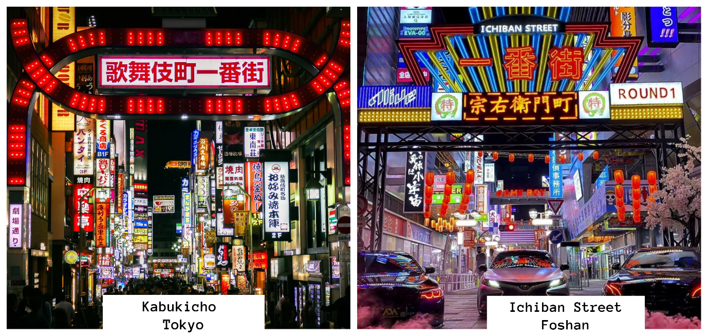
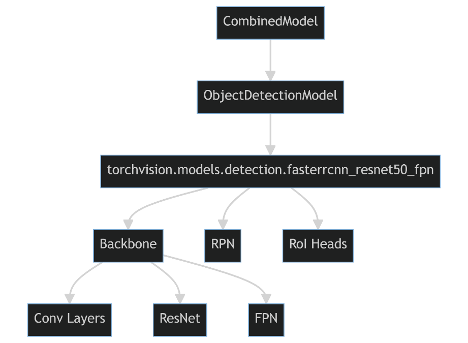
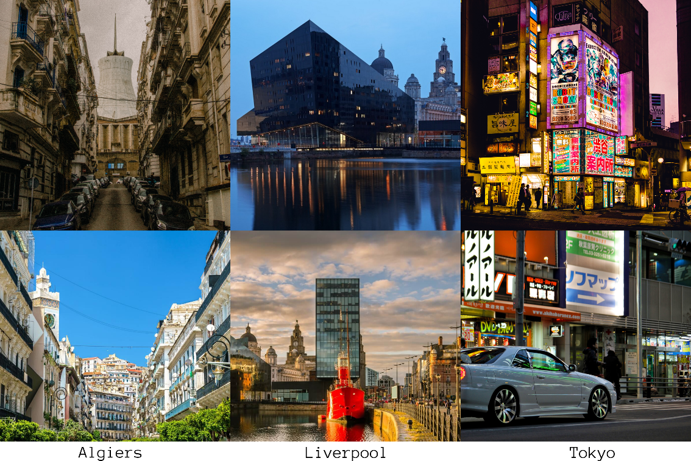
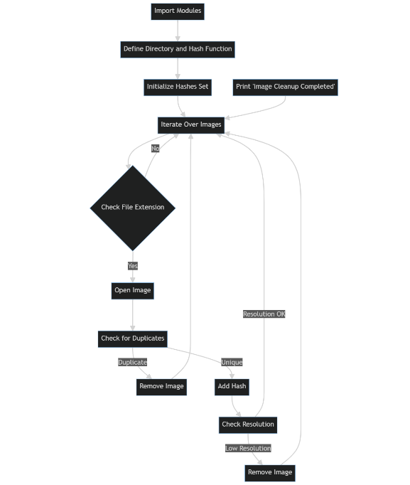
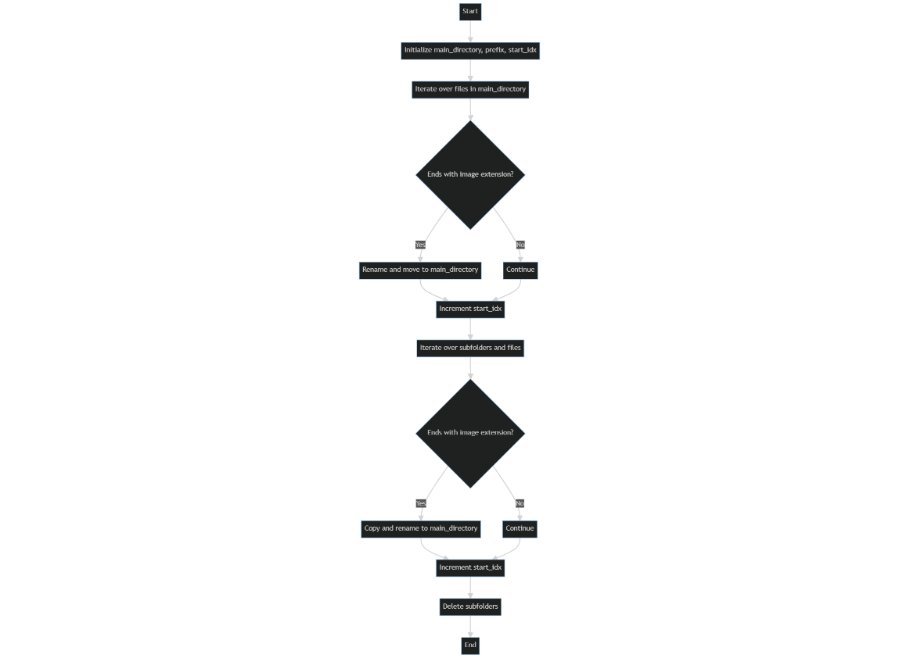
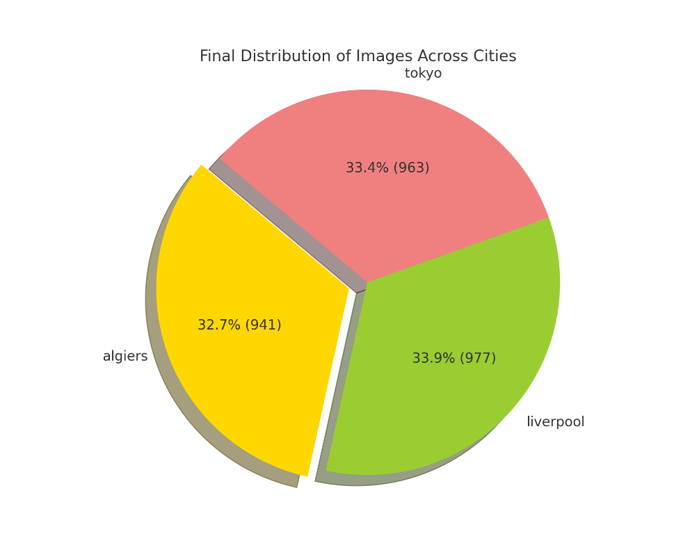
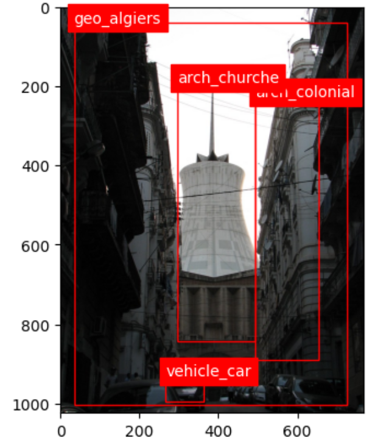
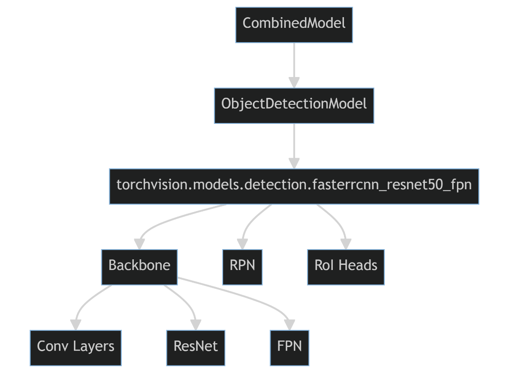
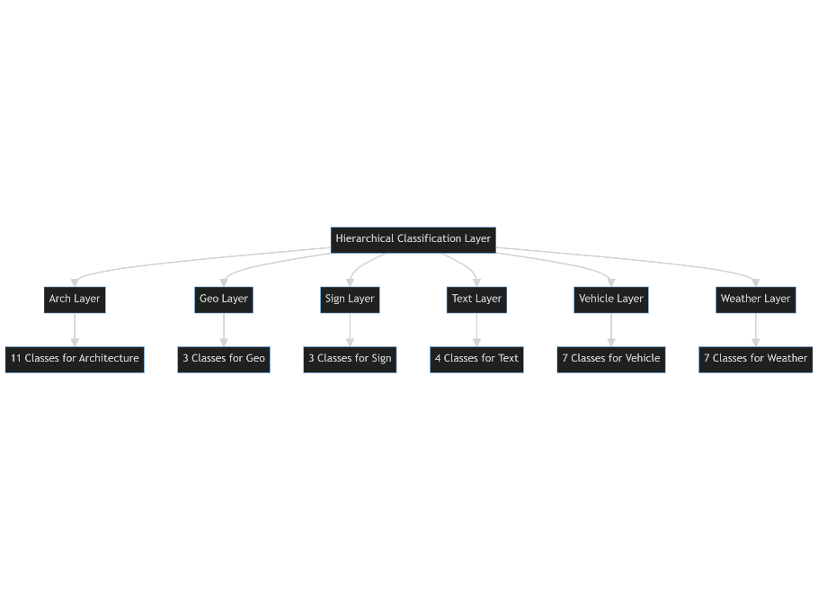
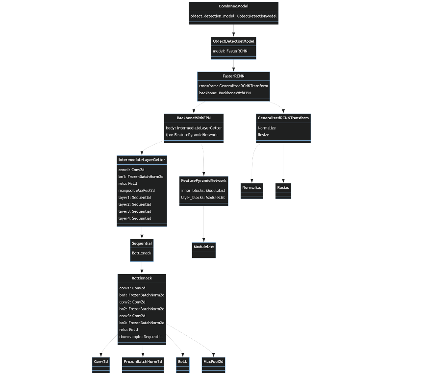

> {width="2.7083333333333335in"
> height="0.7786450131233595in"}

[**Liverpool John Moores University**](http://ljmu.ac.uk/)

**Image Geolocation based on Multi-faceted Features.**

**Mohamed Arezki Ibersienne**

Supervisor:

Dr Carl Chalmers

A thesis submitted in partial fulfilment for the

Degree of Masters in Artificial Intelligence (Machine Learning)

in the

Faculty of

Engineering and Technology

September 2023

# Declaration {#declaration .Not-Heading-1}

I solemnly declare that the research work embodied in this thesis has
been conducted under the aegis of the Faculty of Engineering and
Technology at Liverpool John Moores University. Unless explicitly
mentioned otherwise, all the work presented herein is my own original
undertaking.

During the tenure of my registration as a candidate for the Masters in
Artificial Intelligence (Machine Learning), for which this submission is
now made, I have not been enrolled as a candidate for any other academic
award. Moreover, the research and arguments presented in this thesis
have not been submitted, either in whole or in part, for any other
degree or professional qualification.

Faculty of Engineering and Technology

Liverpool John Moores University James Parsons Building

Byrom Street Liverpool

L3 3AF

UK

# Abstract {#abstract .Not-Heading-1}

This thesis presents a novel approach to geo-prediction using machine
learning techniques, specifically focusing on outdoor urban scenes.
Unlike traditional object detection models, the primary objective of
this research is to predict geographical features based on multiple
attributes such as architecture, weather conditions, and signs. The
methodology employs a Faster R-CNN model with a ResNet-50 backbone and
Feature Pyramid Network (FPN) for real-time object detection, fine-tuned
for 33 unique object categories. The model was trained on a
high-performance NVIDIA A100 GPU, facilitated by Google Colab Pro.The
evaluation metrics were tailored to assess the model\'s proficiency in
geo-prediction rather than object detection. The model underwent 40
epochs of training, with early stopping mechanisms to prevent
overfitting. The training and validation accuracies peaked at
approximately 84.99% and 86.60%, respectively, before showing signs of
overfitting. Loss values indicated effective learning.

**Keywords**: Geo-prediction, Machine Learning, Faster R-CNN, ResNet-50,
Feature Pyramid Network, Object Detection, Urban Scenes, Overfitting,
Early Stopping, NVIDIA A100 GPU, Validation Accuracy, Training Accuracy.

# Acknowledgements {#acknowledgements .Not-Heading-1}

First and foremost, I would like to extend my deepest gratitude to Dr.
Carl Chalmers and Prof. Paul Fergus for their invaluable guidance,
mentorship, and support throughout the course of this research. Your
expertise and insights have been instrumental in shaping this work, and
I am truly grateful for the opportunity to learn from such distinguished
professionals.

To my parents, words cannot express how thankful I am for your
unwavering love and support, especially during this challenging year.
Your sacrifices and encouragement have been my driving force, and this
achievement is as much yours as it is mine.

I would also like to thank everyone who has supported me throughout this
journey. The process of developing this model was arduous, but your
support made it bearable and even enjoyable at times. Whether it was a
word of encouragement, a listening ear, or a helping hand, each one of
you has contributed to this achievement in your own special way.

In a year that has tested us all, I am reminded of the strength and
resilience that can be found in unity and mutual support. Thank you all
for being a part of this incredible journey.

# Contents {#contents .unnumbered}

[Declaration [2](#declaration)](#declaration)

[Abstract [3](#abstract)](#abstract)

[Acknowledgements [4](#acknowledgements)](#acknowledgements)

[Contents [5](#_Toc145093641)](#_Toc145093641)

[Chapter 1 [1](#section)](#section)

[Introduction [1](#introduction)](#introduction)

[1.1 Urban Landscapes as Data Points in Image-Based Geolocation
[1](#urban-landscapes-as-data-points-in-image-based-geolocation)](#urban-landscapes-as-data-points-in-image-based-geolocation)

[1.2 Limitations of Traditional Geolocation Techniques
[3](#limitations-of-traditional-geolocation-techniques)](#limitations-of-traditional-geolocation-techniques)

[1.3 Cognitive Biases and the Role of Deep Learning in Image-Based
Geolocation
[5](#cognitive-biases-and-the-role-of-deep-learning-in-image-based-geolocation)](#cognitive-biases-and-the-role-of-deep-learning-in-image-based-geolocation)

[1.4 Building on Deep Learning
[6](#building-on-deep-learning)](#building-on-deep-learning)

[Chapter 2 [12](#section-1)](#section-1)

[Background and Literature Review
[12](#background-and-literature-review)](#background-and-literature-review)

[2.1 Evolution and Importance of Image-Based Geolocation
[12](#evolution-and-importance-of-image-based-geolocation)](#evolution-and-importance-of-image-based-geolocation)

[2.2 Traditional Geolocation Techniques and Their Limitations
[13](#traditional-geolocation-techniques-and-their-limitations)](#traditional-geolocation-techniques-and-their-limitations)

[2.3 Role of Deep Learning in Geolocation
[15](#role-of-deep-learning-in-geolocation)](#role-of-deep-learning-in-geolocation)

[2.4 Data Standardization and Ontology
[17](#data-standardization-and-ontology)](#data-standardization-and-ontology)

[2.5 Challenges and Solutions in Large-Scale Visual Recognition
[18](#challenges-and-solutions-in-large-scale-visual-recognition)](#challenges-and-solutions-in-large-scale-visual-recognition)

[2.6 Attention Mechanisms and Hierarchical Classification
[20](#attention-mechanisms-and-hierarchical-classification)](#attention-mechanisms-and-hierarchical-classification)

[Chapter 3 [24](#section-2)](#section-2)

[Analysis and Design [24](#analysis-and-design)](#analysis-and-design)

[3.1 Data Preparation [24](#data-preparation)](#data-preparation)

[3.2 Exploratory Data Analysis
[33](#exploratory-data-analysis)](#exploratory-data-analysis)

[3.3 Data Augmentation [41](#data-augmentation)](#data-augmentation)

[3.4 Model Architecture [41](#model-architecture)](#model-architecture)

[3.5 Model Training [48](#model-training)](#model-training)

[3.6 Model Inference [50](#model-inference)](#model-inference)

[3.7 Evaluation metrics [52](#evaluation-metrics)](#evaluation-metrics)

[Chapter 4 [55](#section-3)](#section-3)

[Evaluation [55](#evaluation)](#evaluation)

[4.1 Performance Metrics
[55](#performance-metrics)](#performance-metrics)

[4.2 Inferencing [59](#inferencing)](#inferencing)

[4.3 Summary [61](#summary)](#summary)

[Chapter 5 [63](#section-4)](#section-4)

[Discussion [63](#discussion-1)](#discussion-1)

[5.1 Revisiting the Research Objectives and Hypotheses
[63](#revisiting-the-research-objectives-and-hypotheses)](#revisiting-the-research-objectives-and-hypotheses)

[5.2 Complexity and Nuances of the Model Architecture
[63](#complexity-and-nuances-of-the-model-architecture)](#complexity-and-nuances-of-the-model-architecture)

[5.3 The Good, the Bad, and the Complex
[64](#the-good-the-bad-and-the-complex)](#the-good-the-bad-and-the-complex)

[5.4 Dataset Diversity and Limitations
[64](#dataset-diversity-and-limitations)](#dataset-diversity-and-limitations)

[5.5 The Paradox of Complexity and Dataset Size
[64](#the-paradox-of-complexity-and-dataset-size)](#the-paradox-of-complexity-and-dataset-size)

[5.6 Potential for Scalability
[65](#potential-for-scalability)](#potential-for-scalability)

[5.7 An Indication for Future Research
[66](#an-indication-for-future-research)](#an-indication-for-future-research)

[5.8 Addressing Overfitting and Generalization
[66](#addressing-overfitting-and-generalization)](#addressing-overfitting-and-generalization)

[5.9 Relevance to Real-world Applications
[66](#relevance-to-real-world-applications)](#relevance-to-real-world-applications)

[Chapter 6 [68](#section-5)](#section-5)

[Conclusion and Future work
[68](#conclusion-and-future-work)](#conclusion-and-future-work)

[6.1 Conclusion [68](#conclusion)](#conclusion)

[6.2 Future Work [70](#future-work)](#future-work)

[6.3 Addressing Hypotheses and Aims: A Reflective Analysis
[73](#addressing-hypotheses-and-aims-a-reflective-analysis)](#addressing-hypotheses-and-aims-a-reflective-analysis)

[References [75](#references)](#references)

# 

## Introduction

### Urban Landscapes as Data Points in Image-Based Geolocation

In the field of computer vision, image-based geolocation has emerged as
a critical research area with extensive practical applications,
including but not limited to urban planning, national security, and
emergency response. The capability to accurately determine the
geographical coordinates of an image has significant utility across
these sectors. Moreover, the development of robust geo-localization
models has a cascading effect on the broader field of computer vision.
For instance, consider a computer vision model designed to identify
specific animal species. If this model is integrated with a
geo-localization algorithm, it can significantly improve its accuracy.
Knowing that a particular species of lion is native to certain
geographic regions can help the model make more accurate
identifications. This is particularly useful for conservation efforts,
where precise data is crucial. Similarly, in the context of national
security, combining facial recognition algorithms with geo-localization
can provide a more comprehensive profile of potential security threats.
The geo-tags can help in tracking the movements of individuals, thereby
aiding in predictive policing. Furthermore, in disaster management and
emergency response scenarios, geo-localized images can provide real-time
data that is invaluable for rescue operations. For example, during
floods, a geo-localized image can give rescue teams information not just
about the extent of the flooding, but also its exact location, thereby
facilitating more effective interventions. With the exponential growth
in the availability of geotagged images and advancements in machine
learning algorithms, there is an increasing need for robust and accurate
methods to automatically determine the geographical location of an
image. This challenge involves multidisciplinary approaches that draw on
spatial informatics, pattern recognition, and machine learning, aiming
to bridge the gap between visual data and geographical coordinates, a
feat that holds transformative potential for understanding and
navigating urban landscapes. For instance, Tokyo\'s distinct neon
signage and landmarks like the Tokyo Tower are not merely aesthetic
elements but unique identifiers that contribute to the city\'s digital
fingerprint. These visual cues are crucial for algorithms that aim to
bridge the domain gap between ground and aerial images for more accurate
geo-localization \[1\]. Similarly, Liverpool\'s historical docks and
cultural landmarks, such as those associated with The Beatles, provide a
rich dataset for multi-temporal geo-localization algorithms. These
algorithms leverage time-series data to improve the accuracy of location
prediction, especially in cities with significant historical landmarks
\[2\]. In the other hand Algiers offers a unique blend of French
colonial architecture and traditional North African elements, like the
lanes in its ancient Casbah. This architectural diversity is
particularly beneficial for cross-view image geo-localization algorithms
that require a robust backbone to handle a variety of architectural
elements across different cultures \[3\]. The complexity and diversity
of urban landscapes make them ideal testing grounds for advancing
image-based geolocation technologies. As these algorithms become more
sophisticated, they hold the potential to revolutionize various fields.
In the contemporary digital ecosystem, images are not merely visual
artifacts; they serve as complex repositories of information,
narratives, and in certain cases, vital evidence. This has led to the
burgeoning importance of geo-localization technologies capable of
decoding the geographical narratives embedded within images.
Cutting-edge advancements in this field have not only achieved
unprecedented accuracy down to the sub-pixel level but have also shown
marked improvements in cross-area evaluations, making them invaluable
tools for various applications \[2\], the seamless integration of
digital and physical realms has elevated the significance of images as
critical assets for law enforcement agencies. Photographs shared on
social media platforms, particularly those featuring recognizable
landmarks or cityscapes, can offer crucial leads in a range of
investigations. This is especially true in the context of data
protection, privacy, and security where artificial intelligence and
conventional methods are increasingly being employed for law enforcement
purposes \[4\]. The role of image-based geo-localization in enhancing
global security measures cannot be overstated. It serves as a pivotal
tool in the arsenal of law enforcement agencies, aiding in everything
from routine investigations to national security concerns. This is
particularly true in the context of unmanned aerial vehicles (UAVs),
where deep learning-based cross-view image matching has shown promising
results in geo-localization tasks \[5\].

### Limitations of Traditional Geolocation Techniques

Traditional geolocation methods often rely heavily on metadata, such as
GPS coordinates, to determine the location of an image. While this
approach is straightforward, it has significant limitations. Metadata
can be easily manipulated or stripped from an image, rendering it an
unreliable tool for accurate geolocation. This vulnerability exposes a
critical gap in security applications, where manipulated metadata can
mislead investigations. Another limitation is the geolocation error
estimation, especially in complex data like satellite imagery.
Techniques like the ℓp-ICP Coastline Inflection Method have been
developed to estimate geolocation errors in FY-3 MWRI Data. However,
these methods are not universally applicable and can significantly
impact the reliability of geolocation in critical applications like
weather forecasting \[6\].

Similarly, in the context of mobile incident management systems,
traditional geolocation techniques may not provide the real-time
accuracy required for emergency response. Systems like React
Native-based mobile incident management have shown that relying solely
on traditional methods can result in significant delays and
inaccuracies, affecting the effectiveness of emergency services \[7\].
Traditional methods are often inadequate for complex geolocation
scenarios, such as railway condition monitoring. Hybrid approaches that
combine multi-view stereopsis and real-time kinematic geolocation
pipelines have been developed to address these complexities. However,
these are still in the experimental stage and are not yet widely adopted
\[8\].

Those dated techniques often struggle in diverse environmental
conditions. For instance, methods that work well in urban settings may
not be applicable in rural or wilderness areas. This lack of robustness
limits the utility of traditional methods in applications like wildlife
conservation or disaster management, but also in cities with significant
historical landmarks, traditional geolocation methods often fail to
leverage time-series data effectively. This is a significant limitation
in multi-temporal geolocation algorithms, which require robust methods
to improve the accuracy of location prediction over time. Given these
limitations, there is a growing need for more intrinsic, content-based
approaches to image geolocation.

Deep learning-based pipelines and street view images are emerging as
promising alternatives. These methods aim to improve both the accuracy
and reliability of image-based geolocation, offering a more
comprehensive solution for various applications. The limitations of
traditional geolocation techniques are manifold, ranging from
reliability issues with metadata to inadequacies in handling complex and
diverse scenarios. These challenges have catalyzed the development of
more advanced, content-based approaches that leverage machine learning
and other computational methods. As the field of image-based geolocation
continues to evolve, addressing these limitations will be crucial for
developing more reliable systems.

### Cognitive Biases and the Role of Deep Learning in Image-Based Geolocation

The human brain, often considered an evolutionary marvel, possesses an
innate ability to process visual stimuli with remarkable efficiency.
This cognitive skill extends to the task of geolocating images based
solely on visual cues. While the brain\'s guesses may sometimes be
inaccurate, they often come close to the actual geographical location,
highlighting the brain\'s inherent capability for spatial recognition
\[9\].

However, this cognitive process is not without its limitations. Personal
biases, experiences, and cultural exposure can significantly influence
the interpretation of visual information. For example, someone who has
lived their entire life in a mountainous region may find it challenging
to accurately geolocate an image of a desert landscape. These cognitive
biases present a unique challenge in the field of image-based
geolocation, where the objective is to develop algorithms that can
universally and accurately determine the geographical origins of images
\[10\]. To address these challenges, our research takes inspiration from
the neural networks that constitute the human brain. Deep learning
algorithms, particularly convolutional neural networks (CNNs), have
shown promise in mimicking the human brain\'s ability to process visual
information. These algorithms can be trained to recognize a wide array
of features, from obvious landmarks to more subtle cues like
architectural styles or vegetation types. By leveraging advanced
techniques like transfer learning and data augmentation, our proposed
deep learning system aims to go beyond merely mimicking human cognition.
The goal is to create a system that is not only accurate but also robust
and adaptable to various types of visual information \[11\].

A critical aspect of this research is the use of diverse training data.
By training the model on a wide range of images, from Tokyo\'s bustling
Shibuya crossing to Liverpool\'s historic Albert Dock and Algiers\'
Mediterranean coastline, we aim to create a system that is universally
applicable. This diversity allows the model to recognize both well-known
landmarks and subtler, often overlooked details that are crucial for
accurate geo-localization. The use of diverse training data also
mitigates the impact of cognitive biases, making the model more robust
and reliable.

The limitations of traditional geolocation techniques, such as the
reliance on manipulable metadata and the lack of robustness in diverse
environments, make the role of deep learning even more critical. Deep
learning algorithms offer a more intrinsic, content-based approach to
image geolocation, providing a comprehensive solution that addresses the
limitations of traditional methods.

### Building on Deep Learning

One might argue that human cognition is remarkably adept at identifying
geographical locations based on visual cues. However, this cognitive
skill is far from infallible. The world is replete with regions that,
despite being geographically distant, share strikingly similar visual
characteristics. Whether it\'s the architectural styles, natural
landscapes, or even weather conditions, these similarities can easily
mislead human judgment. For instance, a cobblestone street flanked by
colonial-style buildings could as easily be in a historic district of
Italy as in a similar setting in Liverpool.

{width="6.26875in" height="2.9722222222222223in"}

Figure 1 Side-by-side image of a street in Tokyo and a street in Foshan
that look similar.

This inherent challenge underscores the need for a more reliable,
machine-driven approach to image-based geolocation, one that can
disambiguate between visually similar but geographically distinct
locales. Considering the limitations of traditional geolocation methods
and the promising capabilities of deep learning, this research
introduces a novel model architecture designed to push the boundaries of
image-based geo-localization. The model aims to serve as a comprehensive
solution, specifically tailored to operate in diverse urban environments
like Liverpool, Algiers, and Tokyo.

The foundational layer of the model is the Faster R-CNN architecture, a
well-established object detection model that has been widely adopted in
various computer vision tasks \[12\].

{width="4.179292432195975in"
height="3.0648140857392825in"}

Figure 2 Faster R-CNN Architecture

This choice of backbone serves as the primary feature extractor,
capturing essential visual cues from the input images. The model
transcends traditional geo-localization techniques by amalgamating
multiple features such as architecture, weather, signs, text language,
and vehicles Figure 3. This multi-feature approach is inspired by recent
advancements in deep spatio-temporal predictive modelling\[13\] and
self-adaptive networks \[14\]. The integration of these diverse features
aims to enhance the model\'s robustness and adaptability across
different environments.

{width="4.925543525809274in"
height="3.294435695538058in"}

Figure 3 Picture of Tokyo Label across multiple features

The features extracted by Faster R-CNN are then channeled through a
hierarchical classification layer. To address the challenge of handling
images with a diverse set of features, an attention mechanism is
incorporated. This mechanism weighs the importance of different features
dynamically, a technique that has shown promise in tasks like signal
strength prediction using geographical images \[15\]. The final layer is
the Geo-Prediction Layer, which takes the aggregated features to make
the final geo-localization prediction. This layer employs advanced
algorithms for cross-view image matching, drawing inspiration from
recent works in UAV localization1 and orientation estimation \[16\].

By integrating these advanced techniques and layers, the model aims to
set a new standard in the field of image-based geo-localization.
Designed to be both robust and adaptable, capable of handling the
complexities and nuances of different urban landscapes.

The primary objective of this research is to develop a robust, deep
learning-based model for image-based geolocation that addresses the
limitations of traditional methods and human cognition. Specifically,
the aim is to:

-   Develop a model that can accurately geolocate images based on
    multiple features such as architecture, weather, signs, text
    language, and vehicles.

-   Evaluate the model\'s performance across diverse urban landscapes,
    focusing on three cities: Algiers, Liverpool, and Tokyo.

-   Investigate the potential of the model in various applications,
    including national security, urban planning, and emergency response.

Given the objectives, the following hypotheses were proposed, each
grounded in the existing literature and the identified gaps in current
geolocation techniques:

1.  **Deep Learning Superiority:** Deep learning algorithms will
    significantly outperform traditional geolocation methods in terms of
    accuracy and reliability. This hypothesis is based on the
    limitations of traditional methods, which often rely on manipulable
    metadata and are less robust in diverse environments.

2.  **Feature Integration:** The integration of multiple features such
    as architecture, weather, and text language will enhance the
    model\'s ability to disambiguate between visually similar but
    geographically distinct locations. This hypothesis stems from the
    understanding that a multi-feature approach can capture the unique
    \"fingerprint\" of a location more effectively.

3.  **Adaptability Across Landscapes:** Given the diversity of the urban
    landscapes of Algiers, Liverpool, and Tokyo, the model will
    demonstrate high adaptability and performance across these different
    settings. This is based on the premise that a robust model should be
    universally applicable and not limited to specific geographies.

The rest of this paper is organized into several chapters, each serving
a specific purpose in the narrative of this research. Chapter 2, titled
\"Background and Literature Review,\" provides an overview of
traditional geolocation techniques, the role of deep learning in
image-based geolocation, and the limitations of existing methods.
Following this, Chapter 3, \"Analysis and Design,\" details the data
collection, data labelling, exploratory data analysis, model building,
training, and evaluation processes. Chapter 4, \" Evaluation,\" presents
the performance metrics and evaluation of the model, discussing its
strengths and weaknesses. In Chapter 5, \"Discussion,\" where the
implications of the research findings are discussed, potential
applications, and limitations of the study. Finally, Chapter 6, \"Future
Work and Conclusion,\" outlines avenues for future research and provides
a conclusion summarizing the key findings of the study.

By adhering to this structure, the aim is to provide a comprehensive
exploration of the challenges and opportunities in the field of
image-based geolocation.

# 

## Background and Literature Review

### Evolution and Importance of Image-Based Geolocation

The advent of digital photography and the proliferation of smartphones
have led to an explosion in the number of images captured and shared
online. This has spurred interest in the field of image-based
geolocation, which aims to determine the geographical location where a
photograph was taken. The importance of this field extends beyond mere
academic interest; it has practical applications ranging from forensic
investigations to enhancing user experiences on social media platforms.

The book \"Large-Scale Image Geolocalization\" delves into the
complexities of global image geolocalization, emphasizing the challenges
posed by the nonuniform distribution of training data and the
limitations of traditional methods like land-cover recognition \[17\].
Similarly, \"CMLocate: A cross‐modal automatic visual geo‐localization
framework for a natural environment without GNSS information\" explores
the potential of cross-modal frameworks that can operate even in the
absence of Global Navigation Satellite System (GNSS) data, thereby
expanding the scope and applicability of image-based geolocation \[18\].

The evolution of this field has been marked by significant advancements
in machine learning algorithms and computational capabilities. \"Where
in the World is this Image? Transformer-based Geo-localization in the
Wild\" discusses the application of transformer-based models for
geolocation, highlighting their ability to outperform traditional
convolutional neural networks (CNNs) in certain benchmarks \[19\]. This
resonates with the work presented in \"NetVLAD: CNN Architecture for
Large Scale Visual Place Recognition,\" which introduces a novel
generalized VLAD layer that can be integrated into any CNN architecture,
thereby enhancing its geolocation prediction capabilities\[20\].

The article \"More than Meets the Eye: Geolocating Images Using
Creativity and SunCalc\" takes a unique approach by incorporating the
position of the sun, calculated using SunCalc, to improve geolocation
accuracy \[21\]. This creative method underscores the multidisciplinary
nature of the field, which combines computer science, geography, and
even astronomy to solve complex problems. Another noteworthy
contribution is \"Large-scale Image Geo-Localization Using Dominant
Sets,\" which employs dominant sets to cluster similar images, thereby
improving the model\'s ability to generalize across different
geographical locations \[22\]. Standardization efforts, as discussed in
\"Ontology of Units of Measure and Related Concepts,\" are crucial for
ensuring the consistency and reliability of geolocation prediction
models that rely on quantitative data extracted from images \[23\]. The
paper compares different approaches to modeling the domain of quantities
and units of measure, highlighting the importance of a formal
understanding of data, especially when dealing with diverse datasets
from various geographic locations.

### Traditional Geolocation Techniques and Their Limitations

The field of geolocation has evolved significantly over the years, with
traditional methods primarily relying on GPS coordinates and metadata
for location prediction. However, these techniques have been found to be
susceptible to various limitations. For instance, the work by Crandall
et al. in \"Inferring Social Ties from Geographic Coincidences\"
highlighted the unreliability of GPS data, especially in urban
environments where signal interference is common \[24\]. Similarly, the
study by Hays and Efros in \"IM2GPS: Estimating Geographic Information
from a Single Image\" pointed out that GPS metadata can be easily
manipulated or stripped, making it an unreliable source for accurate
geolocation.

The limitations of traditional techniques are not just confined to the
manipulation of data. The paper \"Semantic Image Based Geolocation Given
a Map\" by Mousavian and Kosecka discusses the challenges of using maps
and sparse sets of geo-tagged reference views for geolocation \[25\].
They emphasize the need for more robust methods that can handle complex
and diverse data sets, especially in urban environments.

Another critical issue with traditional methods is the lack of
standardization. The paper \"Ontology of Units of Measure and Related
Concepts\" underscores the need for standardizing units of measure to
ensure the consistency and reliability of geolocation models \[23\].
This is particularly important when dealing with diverse datasets from
various geographic locations. The comparison between the Ontology of
Units of Measure (OM) and another active effort for an OWL model in this
domain, QUDT, sheds light on the different approaches to modeling the
domain of quantities and units of measure.

In the realm of large-scale visual recognition, the paper \"NetVLAD: CNN
Architecture for Large Scale Visual Place Recognition\" introduces a
novel convolutional neural network (CNN) architecture that could
potentially address some of these limitations. The architecture\'s
ability to outperform non-learned image representations on challenging
place recognition benchmarks underscores its potential applicability in
geolocation prediction tasks \[20\].

Moreover, the paper \"Large-scale Image Geo-Localization Using Dominant
Sets\" discusses the challenges of scale and the need for algorithms
that can handle large datasets. This resonates with the work \"More than
Meets the Eye: Geolocating Images Using Creativity and SunCalc,\" which
explores creative approaches to geolocation, such as using the position
of the sun in the sky, to overcome the limitations of traditional
methods\[22\] \[21\].

In summary, while traditional geolocation methods have their merits,
they are fraught with limitations ranging from data manipulation risks
to lack of standardization and the inability to handle large and diverse
datasets. These challenges have paved the way for the development of
more advanced, deep learning-based methods that promise higher accuracy
and reliability in image-based geolocation tasks.

### Role of Deep Learning in Geolocation

The advent of deep learning has revolutionized various domains,
including image recognition, natural language processing, and autonomous
vehicles. One area that has particularly benefited is the field of
geolocation. Traditional geolocation techniques often rely on metadata
or manual tagging, which are not only prone to errors but also easily
manipulable. Deep learning offers a more intrinsic, content-based
approach to image geolocation, providing a comprehensive solution that
addresses these limitations.

The importance of deep learning in geolocation is further emphasized by
the issue of data deprivation in many parts of the world, particularly
in low-income countries. A study conducted on road traffic crashes in
Nairobi, Kenya, highlighted this issue and demonstrated how machine
learning techniques could help fill these data gaps\[26\]. The study
used crowdsourced data from Twitter to create a geolocated dataset of
road traffic crashes. This approach could be extended to other types of
geolocation applications, demonstrating the potential of deep learning
in harnessing crowdsourced data for geolocation tasks.

Similarly, \"Word embeddings and deep learning for location prediction:
tracking Coronavirus from British and American tweets\" discusses the
application of deep learning algorithms for tracking the spread of
diseases through geolocation data extracted from social media\[27\].

Another significant contribution of deep learning to geolocation is its
ability to handle large and complex datasets. For instance, the NetVLAD
architecture introduced a novel generalized VLAD layer that can be
seamlessly integrated into any CNN architecture \[20\]. This
architecture\'s ability to outperform non-learnt image representations
and off-the-shelf CNN descriptors on challenging place recognition
benchmarks underscores its potential applicability in geolocation
prediction tasks \[22\].

Moreover, deep learning algorithms can adapt to the unique challenges
posed by geolocation tasks. For example, identifying unique locations
from multiple references in a tweet is a technical challenge that deep
learning algorithms are well-equipped to handle \[21\]. Such algorithms
can sift through the noise and identify the most relevant features for
accurate geolocation, something that traditional methods struggle with.

The role of deep learning in geolocation is not just limited to
improving accuracy; it also extends to ensuring the consistency and
reliability of geolocation prediction models. Standardizing the units of
measure and ensuring a formal understanding of data is crucial,
especially when dealing with diverse datasets from various geographic
locations \[23\]. The comparison between the Ontology of Units of
Measure (OM) and another active effort for an OWL model in this domain,
QUDT, sheds light on the different approaches to modeling the domain of
quantities and units of measure6. Such standardization efforts can be
instrumental in ensuring the consistency and reliability of geolocation
prediction models that rely on quantitative data extracted from images.

The paper \"Global Forensic Geolocation with Deep Neural Networks\"
introduces DeepSpace, a new algorithm for geolocation that employs deep
neural networks. This algorithm has been particularly useful in forensic
analyses for identifying the provenance of materials at a crime scene,
reducing errors by up to 60% in some cases \[28\].

Moreover, the paper \"Designing weighted and multiplex networks for deep
learning user geolocation in Twitter\" delves into the intricacies of
designing networks for deep learning algorithms that can effectively
geolocate users based on their Twitter activity \[29\]. These papers
collectively highlight the versatility and efficacy of deep learning
algorithms in geolocation tasks, ranging from forensic applications to
urban planning and disease tracking.

In conclusion, deep learning has a pivotal role in advancing the field
of geolocation. It offers a robust, accurate, and reliable method for
geolocating images, making it an indispensable tool for various
applications, from social media platforms to forensic investigations.

### Data Standardization and Ontology

Data standardization and ontology play a pivotal role in the field of
image-based geolocation prediction. The need for a standardized approach
to data interpretation and representation is increasingly becoming a
focal point of research. One of the seminal works in this area is the
\"Ontology of Units of Measure and Related Concepts\" \[23\]. This paper
emphasizes the importance of making quantitative research data more
explicit and underscores the need for standardization and the formal
meaning of data, especially when dealing with diverse datasets from
various geographic locations. The comparison between the Ontology of
Units of Measure (OM) and another active effort for an OWL model in this
domain, QUDT, sheds light on the different approaches to modeling the
domain of quantities and units of measure. Such standardization efforts
can be instrumental in ensuring the consistency and reliability of
geolocation prediction models that rely on quantitative data extracted
from images. In the context of geographic object-based image analysis
(O-GEOBIA), the paper \"Leveraging Machine Learning to Extend
Ontology-Driven Geographic Object-Based Image Analysis: A Case Study in
Forest-Type Mapping\" \[30\] discusses the importance of ontology and
how machine learning can be integrated into this framework for better
classification accuracy. The paper also delves into the challenges and
solutions related to data fusion and feature selection in the context of
O-GEOBIA. Another study titled \"An Object-Based Semantic Classification
Method for High Resolution Remote Sensing Imagery Using Ontology\"
\[31\] explores the role of ontology in high-resolution remote sensing
imagery.

The paper presents a method that leverages ontology for object-based
semantic classification, thereby enhancing the accuracy and reliability
of geolocation prediction models. The paper \"Ontology guided image
understanding: A preliminary study\" \[32\]further explores the role of
ontology in image understanding. It presents a preliminary study that
employs ontology-guided techniques to improve the semantic understanding
of images, which is crucial for accurate geolocation prediction. Lastly,
the paper \"A grounding-based ontology of data quality measures\" \[33\]
discusses the importance of grounding-based ontology in the assessment
of data quality measures. This paper highlights the need for a formal
ontology that can guide the evaluation of data quality, especially in
the context of image-based geolocation prediction where the quality of
the extracted features can significantly impact the model\'s
performance.

In summary, the role of data standardization and ontology in image-based
geolocation prediction cannot be overstated. These efforts not only
contribute to the reliability and consistency of prediction models but
also pave the way for more advanced techniques that leverage machine
learning and semantic understanding.

### Challenges and Solutions in Large-Scale Visual Recognition

The advent of deep learning has revolutionized the field of computer
vision, particularly in the realm of large-scale visual recognition.
However, the scale itself presents a set of unique challenges that
researchers and practitioners must navigate. One of the seminal works in
this area is the paper \"Large-Scale Image Geolocalization\" \[17\],
which laid the foundation for using Convolutional Neural Networks (CNNs)
for geolocalization tasks. The paper highlighted the challenges of
handling a massive dataset and the computational resources required for
training such models.

The paper \"Large-scale Image Geo-Localization Using Dominant Sets\"
\[22\]took a different approach by introducing the concept of dominant
sets to improve the efficiency of large-scale image geolocalization. The
authors argued that by focusing on dominant sets, one could reduce the
computational complexity without sacrificing accuracy. This work
resonates with the challenges of large-scale visual recognition, where
computational efficiency is often at odds with model performance. In a
similar vein, the book \"Large Scale Visual Geo-Localization of Images
in Mountainous Terrain\" \[34\] tackled the problem of geolocalizing
images in challenging terrains. The book emphasized the difficulties of
large-scale visual recognition in such terrains, where traditional
methods often fail. The authors proposed a novel algorithm that
considers the topological features of the terrain, thereby improving the
model\'s accuracy. A more recent contribution to this field is the paper
\"Rethinking Visual Geo-localization for Large-Scale Applications\" by
Gabriele Berton and colleagues. This paper introduces a new dataset
called San Francisco eXtra Large (SF-XL) and a new training technique
called CosPlace. The paper addresses the limitations of current datasets
and methods, offering a more scalable and efficient approach. The
introduction of CosPlace as a training technique is particularly
noteworthy as it opens possibilities for adapting the model for even
larger datasets, addressing one of the key scalability concerns \[35\].
The issue of data standardization also plays a crucial role in
large-scale visual recognition. The paper \"Ontology of Units of Measure
and Related Concepts\" \[23\] emphasizes the importance of making
quantitative research data more explicit. While the primary focus is on
the ontology of units of measure, the principles discussed are pertinent
to the domain of large-scale visual recognition. Standardizing the units
of measure and ensuring a formal understanding of data is crucial,
especially when dealing with diverse datasets from various geographic
locations.

However, the challenges are not just technical but also ethical. Data
privacy is a growing concern, especially when collecting large-scale
geo-tagged images. The need to balance data utility with privacy
considerations is a challenge that researchers must address. Another
ethical concern is data bias, which can significantly impact the
performance of large-scale visual recognition models. The paper
\"Fairness in Machine Learning: Lessons from Political Philosophy\"
\[36\] discusses the ethical implications of data bias and suggests ways
to mitigate its effects. While the paper is not specific to visual
recognition, its principles are highly applicable, emphasizing the need
for fairness and equity in machine learning models. But also, again the
paper \"More than Meets the Eye: Geolocating Images Using Creativity and
SunCalc\" \[21\] introduces a novel approach to geolocation that uses
the position of the sun in the sky to estimate the location of the
image. This approach is particularly useful for large-scale visual
recognition tasks where traditional methods may fail due to the lack of
distinguishable landmarks.

In summary, the challenges in large-scale visual recognition are
multifaceted, ranging from computational constraints and data
standardization to ethical considerations. Various research papers have
proposed solutions to these challenges, but the field is still evolving.
As technology advances, it is crucial to continue exploring innovative
solutions to these challenges to unlock the full potential of
large-scale visual recognition for geolocation tasks.

### Attention Mechanisms and Hierarchical Classification

The advent of attention mechanisms has revolutionized the field of
machine learning, particularly in tasks that require the model to focus
on specific parts of the input data. Attention mechanisms have been
especially impactful in natural language processing (NLP), image
recognition, and, more recently, in geolocation prediction. These
mechanisms allow models to weigh the importance of different features,
thereby improving their performance significantly. Attention mechanisms
serve a crucial role in identifying and focusing on relevant features
within an image. For instance, the paper \"Learning a Hierarchical
Global Attention for Image Classification\" discusses the use of a
hierarchical global attention mechanism in convolutional neural networks
(CNNs) to improve image classification \[37\]. The mechanism aims to
provide a comprehensive feature representation by considering both local
and global information. This is particularly useful in geolocation tasks
where both macro and micro-level details can be pivotal for accurate
prediction. Similarly, the paper \"An Attention-Based Architecture for
Hierarchical Classification with CNNs\" proposes an architecture that
allows neural networks to decide how different branches must be
connected for hierarchical classification \[38\]. This is particularly
relevant for geolocation prediction models that need to classify images
based on multiple hierarchical categories such as architecture style,
geographic region, and weather conditions.

Attention mechanisms are not just limited to image-based tasks. The
paper \"Hierarchical Attention Networks for Document Classification\"
extends the concept to document classification, focusing on two
distinctive characteristics---word and sentence level attentions \[39\].
This hierarchical approach can be adapted for geolocation prediction
where different levels of attention can be applied to various features
like architectural details, signs, and even weather conditions.

The paper \"A General Survey on Attention Mechanisms in Deep Learning\"
provides a comprehensive taxonomy of attention mechanisms and discusses
their applications in various domains \[40\]. The paper categorizes
attention mechanisms into soft and hard types, each with its advantages
and disadvantages. Soft attention mechanisms are generally easier to
train but may not be as interpretable as hard attention mechanisms. This
distinction is crucial in geolocation prediction tasks where
interpretability can be as important as accuracy, especially in
applications like forensic investigations.

Hierarchical classification is another area that has seen significant
advancements, especially with the integration of attention mechanisms.
Hierarchical classification allows the model to make decisions at
multiple levels, thereby providing a more nuanced understanding of the
data. In the context of image-based geolocation, this could mean first
classifying the general region an image likely belongs to and then
further narrowing it down to a specific city or even a neighborhood.
Similarly, the paper \"Hierarchical Classification of Images by Sparse
Approximation\" presents a method that employs sparse approximation
techniques for hierarchical image classification \[41\] . This approach
is particularly useful in geolocation prediction tasks where the model
needs to make decisions at multiple levels, from continents to countries
to cities.

The integration of attention mechanisms and hierarchical classification
in geolocation prediction models offers a robust and nuanced approach to
identifying an image\'s geographic location. By focusing on relevant
features and making decisions at multiple levels, these advanced
techniques significantly improve the model\'s accuracy and reliability.
A significant contribution is the paper \"Attention Is All You Need,\"
which introduced the Transformer architecture \[42\]. The architecture
employs multiple attention mechanisms and has been highly influential in
both NLP and computer vision tasks, including geolocation prediction.
The Transformer\'s ability to handle sequences makes it particularly
useful for tasks that involve temporal or spatial sequences, such as
tracking the movement of objects or predicting the geolocation of a
series of images.

Moreover, the paper \"Hierarchical Deep Learning for Text
Classification\" extends the concept of hierarchical classification to
text data. While not directly related to image-based geolocation, the
principles can be adapted to handle textual features within images, such
as signs or labels, thereby providing another layer of information for
more accurate geolocation prediction \[43\].

In summary, attention mechanisms and hierarchical classification have
shown significant promise in improving the accuracy and reliability of
image-based geolocation prediction models. These advanced techniques
allow models to focus on relevant features and make nuanced decisions,
thereby addressing the complexities inherent in geolocation prediction
tasks. The integration of these techniques is not just a theoretical
advancement but a practical necessity, given the increasing demand for
accurate and reliable geolocation prediction in various applications
ranging from social media to forensic investigations.

#  

## Analysis and Design

### Data Preparation

#### Data Collection 

The dataset for this research primarily focuses on outdoor urban scenes,
which are abundant in features like architecture, vehicles, signs, and
varying weather conditions. This approach aligns with the work of
Belcher et al. \[44\], who emphasized the importance of feature-rich and
contextually relevant images in machine learning applications. The
dataset aims to capture the essence of three distinct cities: Liverpool,
Algiers, and Tokyo. Criteria for image selection were established to
ensure the dataset\'s relevance and quality:

-   **Outdoor Focus:** Indoor images were excluded, as the study\'s
    emphasis is on geolocation.

-   **Feature-Rich:** Images were chosen based on their richness in
    features pertinent to geolocation, such as architecture and weather
    conditions.

-   **Exclusion Criteria:** Images lacking discernible features or
    containing explicit faces were excluded due to ethical
    considerations.

{width="5.145429790026247in"
height="3.435416666666667in"}

Figure 4 Sample images from each of the three cities (Algiers,
Liverpool, Tokyo).

Images were scraped from multiple online sources like Flickr, Pexels,
and Bing using custom scripts. Each source had its own set of
limitations, such as API rate limits in the case of Flickr. These
challenges in data collection resonate with the findings of a survey on
data collection for machine learning, which highlighted the
often-overlooked complexities of gathering quality data \[45\]. The
initial dataset comprised over 6,000 raw images, which were later pruned
during the data cleaning process. A preliminary analysis was conducted
to ensure the images met the study\'s criteria. This step is crucial as
emphasized by a study in Digital Medicine, which stated that data
collection sets the stage for subsequent analyses and insights \[46\].

#### Data Cleaning 

The initial dataset comprised over 6,000 raw images collected from
various sources. Given the sheer volume and diversity of the data, it
was imperative to employ both automated and manual data cleaning
techniques to ensure the quality and relevance of the images for the
study. Custom scripts were developed to automate the initial stages of
the data cleaning process. These scripts performed tasks such as:

-   **Duplicate Removal:** Utilizing hash algorithms, the script
    identified and removed duplicate images to avoid redundancy in the
    dataset, a technique also emphasized in \"ImageDC: Image Data
    Cleaning Framework Based on Deep Learning\" \[47\].

-   **Dimension Filtering:** To maintain a standard quality across the
    dataset, images with dimensions below a width and height of 512
    pixels were automatically filtered out.

{width="2.619907042869641in"
height="3.096379046369204in"}

Figure 5 Algorithm diagram showing the data cleaning process.

While automated scripts are efficient for bulk cleaning, they lack the
nuanced understanding required for more complex tasks. Therefore, a
manual review of the dataset was conducted to:

-   Remove images that were not relevant to the study, such as indoor
    images or natural landscapes devoid of architectural or vehicular
    features.

-   Eliminate images with explicit faces directed towards the camera to
    adhere to privacy concerns.

The dataset underwent a rigorous validation process to ensure its
quality and relevance for the study. This involved:

-   Quality Checks: Each image was manually reviewed to confirm that it
    met the established criteria for dimensions and content.

-   Validation Metrics: Although the study primarily focuses on
    qualitative aspects, basic validation metrics were employed to
    ensure the dataset\'s integrity, echoing the sentiment of \"A Review
    on Data Cleansing Methods for Big Data\" \[48\].

To further streamline the dataset and facilitate easier tracking and
analysis, a custom script was developed to rename the images in each
city-specific folder (Liverpool, Algiers, Tokyo). The renaming followed
a numerical sequence, starting from 0000 and incrementing by one for
each subsequent image. This systematic approach to naming not only made
it easier to reference specific images but also aided in the automation
of subsequent data processing steps. The renaming process is in line
with best practices for data organization. We can see the Renaming
Script Algorithm Diagram and a screenshot of a sample folder showing the
renamed images in numerical sequence respectively Figure 6 & Figure 7 .

{width="2.193675634295713in"
height="3.8095680227471567in"}

Figure 6 Algorithm Diagram showing the Rename script process.

{width="5.135477909011374in"
height="2.7458245844269467in"}

Figure 7 A screenshot of a sample folder showing the renamed images in
numerical sequence.

The data cleaning process was not without its challenges:

-   **API Limitations:** The use of Flickr and Bing APIs for data
    collection came with rate limits, affecting the volume of data that
    could be collected in each time frame.

-   **Manual Review:** The manual review process, although necessary,
    was time-consuming and introduced a subjective element to the data
    cleaning process, as highlighted by \"Study on image data cleaning
    method of early esophageal cancer based on VGG_NIN neural network\"
    \[49\].

After the rigorous cleaning process, the dataset was narrowed down to
approximately 2,881 images, with each city---Liverpool, Algiers, and
Tokyo---contributing around 30% of the total images Figure 8. This was
in line with our initial aim for balanced representation across the
three cities.

{width="3.8512160979877517in"
height="3.0812281277340334in"}

Figure 8 Pie chart showing the final distribution of images across the
three cities.

#### Data Labeling 

For data annotation, a combination of Amazon S3 and Label Studio was
employed to create a robust and scalable annotation pipeline. Amazon S3
was utilized for data storage Figure 9, ensuring a secure and easily
accessible data repository, while Label Studio was used for the actual
annotation process.

{width="4.037310804899388in"
height="0.7747200349956256in"}

Figure 9 Amazon S3 Bucket Used for Data Storage

The integration of these platforms enabled seamless data management and
backup capabilities. After collecting the image data, it was uploaded to
an S3 bucket. This provided several benefits:

-   **Data Backup:** Ensured that all collected data was securely backed
    up.

-   **Easy Access:** Facilitated quick access to data regardless of
    location.

-   Scalability: Allowed for easy scaling of the data storage
    infrastructure as the project grew.

The S3 bucket was linked to Label Studio, enabling direct access to the
stored images for annotation. In Label Studio, two types of annotations
were primarily used: polygon labels and bounding box labels. Polygon
labels were employed to annotate features with irregular shapes, such as
weather conditions and architectural styles. This allowed for a more
precise capture of the features in question. On the other hand, bounding
boxes were used for annotating features that had more regular shapes,
like vehicles, signs, and textual content.

To maintain consistency in the data format, bounding boxes were later
computed from the polygon annotations during the post-annotation phase.
This was crucial for standardizing the labeled data and making it easier
to integrate into the deep learning model.

{width="4.531392169728784in"
height="3.0311504811898513in"}

Figure 10 Labeled Photo of Tokyo

The data labeling process was intricate, requiring a high level of
attention to detail. Due to the diversity of features present in each
image, up to 30 annotations were made per image, increasing both the
time required for labeling and the overall complexity of the data.

By leveraging the capabilities of Amazon S3 for data storage and Label
Studio for data annotation, a scalable and efficient data labeling
methodology was established. This approach was specifically tailored to
the unique needs of this project, providing the flexibility to adapt as
the project\'s requirements evolved.

Detailed Annotation Schema for Efficient Data Management and Training

Our annotation strategy was designed not only for data categorization
but also to aid in more efficient model training. Utilizing a
prefix-based labeling system facilitated the dynamic allocation of
features to specific layers in our deep learning model. This not only
streamlined the training process but also allowed for granular control
over feature extraction and representation learning.

Here is a table summarizing the annotation schema:

{width="5.014695975503062in"
height="2.6984689413823273in"}

Figure 11 Overview of Prefix-Based Categories and Their Descriptions

The prefixed labels provided two key advantages during the model
training process:

-   **Layer-specific Feature Routing:** The prefixed labels helped us in
    specifying which features would be processed by which layers in our
    neural network. For instance, weather-related features could be
    processed by layers specialized in understanding natural scenes,
    while architecture-related features could be sent to layers
    optimized for structural recognition.

-   **Ease of Feature Management:** The use of prefixes made it easier
    to manipulate and manage features during both the training and
    inference stages. This was particularly useful for quick feature
    ablation studies, where we could easily include or exclude specific
    sets of features to understand their impact on model performance.

By leveraging this detailed annotation schema in combination with
advanced tools and cloud-based data storage solutions, we were able to
establish a robust, scalable, and efficient methodology for data
labeling and model training.

### Exploratory Data Analysis

Exploratory Data Analysis (EDA) is a cornerstone in the field of data
science. It serves as a preliminary step for understanding complex
datasets, such as the one used in this study. EDA helps in identifying
patterns, anomalies, and key features that are crucial for subsequent
machine learning models. According to a paper published in the 2021 6th
International Conference on Communication and Electronics Systems, EDA
is essential for deriving critical business insights and is a
fundamental process for investigating data anomalies, missing data, and
patterns \[50\].

The EDA techniques employed in this study aim to address the unique
challenges posed by our dataset. These challenges include a variety of
annotated features and geographical tags. Techniques such as
distribution analysis, category co-occurrence heatmaps, and bounding box
area comparisons are particularly relevant. These methods provide
insights into how features are distributed across different geographical
contexts, thereby aiding in feature engineering and model selection
processes.

#### Distribution of Annotations Across Categories and Geographical Tags

Understanding the distribution of annotations across different
categories and geographical tags is crucial for several reasons. First,
it provides insights into the diversity and richness of the dataset.
Second, it helps identify potential biases or imbalances that could
affect the performance of machine learning models1. Lastly, it informs
the feature engineering process, guiding the selection of relevant
attributes for model training. To analyse the distribution, we employ
bar plots and histograms, as these visual tools offer a straightforward
way to compare the frequency of different categories and geographical
tags \[51\]. For example, a bar plot can show the number of annotations
for each category---such as vehicles, architecture, and weather
conditions---across different categories and each city.

{width="5.243264435695538in"
height="3.293742344706912in"}

Figure 12 Bar Plot showing the Distribution of Annotations Across
Categories for Each City.

Preliminary analysis reveals some interesting patterns. For instance,
vehicle car elements are more frequently annotated in images from
Algiers, while vehicle taxi annotations are more common in Tokyo. These
insights are valuable for understanding how features are geographically
distributed, which is essential for building robust machine learning
models.

Interestingly, the class imbalance observed in categories like
sign_tokyo and text_japanese is not merely a statistical issue but a
meaningful characteristic of the dataset. This imbalance serves as a
feature for geolocation-based models. For example, the high frequency of
signs and Japanese text is indicative of Tokyo\'s urban landscape.
Similarly, the imbalance in categories like weather conditions and types
of vehicles also carries geographical significance. The absence or
scarcity of certain categories can be as informative as their presence,
offering additional layers of features for machine learning models.

#### Addressing Imbalances

The presence of class imbalances in categories such as sign_tokyo,
text_japanese, and various types of vehicles and weather conditions
raises the question of whether data balancing techniques should be
employed. After careful consideration, we have decided against balancing
the dataset for several compelling reasons:

-   **Geographical Indicators:** Categories like sign_tokyo and
    text_japanese are not merely imbalanced classes but serve as
    geographical indicators. Their prevalence or absence can provide
    valuable insights into the geolocation of an image.

-   **Informative Imbalances:** Similarly, imbalances in weather
    conditions or types of vehicles are not statistical anomalies but
    reflect real-world variations. For instance, the higher frequency of
    sunny weather images could indicate a geographical area where sunny
    days are more common.

-   **Feature Significance:** The absence of certain features can be as
    informative as their presence. For example, the lack of motorcycle
    annotations could indicate a region where motorcycles are less
    commonly used, which itself is a useful feature for geolocation.

-   **Model Robustness:** Modern machine learning algorithms are often
    robust to class imbalances and can be fine-tuned to handle them
    effectively.

Given the informative nature of the imbalances in our dataset, we have
opted for a more nuanced approach that preserves the integrity and
richness of the data, thereby enabling more accurate and insightful
analyses.

#### Distribution of Annotations per Image

The number of annotations per image is another critical aspect to
consider in our EDA. This metric can vary significantly across the
dataset, affecting both the computational complexity and the model\'s
ability to generalize. Understanding this distribution is essential for
optimizing the machine learning algorithms and ensuring that they can
handle images with varying numbers of annotations effectively. We use
histograms to visualize the distribution of annotations per image. This
graphical representation allows us to quickly identify the range and
frequency of annotation counts across the dataset Figure 13.

{width="2.60203302712161in"
height="2.550505249343832in"}

Figure 13 Distribution of Annotations per Image.

Initial findings indicate that most images have a moderate number of
annotations, there are outliers with exceptionally low counts. This is
particularly important for machine learning models that are sensitive to
input size, such as convolutional neural networks.

#### Visualizing a Sample Image with Annotations

Visualizing the actual images along with their annotations is not just a
supplementary step but a core part of understanding the complexity and
diversity of the dataset. This approach aligns with the insights
provided by Jan Majewski in his article on improving visualization
readability, emphasizing that effective annotations can significantly
enhance the clarity and depth of visual data representations \[52\]. To
provide a comprehensive view of the dataset, we randomly select a sample
image and overlay it with its corresponding annotations. These
annotations include bounding boxes and category labels, serving as a
microcosm of the dataset. This methodology is consistent with best
practices in data visualization, which advocate for the use of
meaningful text and annotations to make the data easier to interpret
across different teams\[52\].

{width="1.6827744969378828in"
height="2.00785542432196in"}{width="3.5476148293963257in"
height="2.007956036745407in"}

Figure 14 Visualizing images along with their annotations.

The sample image serves as a case study, revealing multiple layers of
complexity. For example, it shows how different categories like
vehicles, buildings, and weather conditions co-exist in a single frame.
This complexity is not just a challenge but also an opportunity, as it
underscores the need for a machine learning model that can handle
multi-label classification. The importance of understanding this
complexity is echoed in the literature, emphasizing that the quality of
a model\'s output is highly dependent on the quality of its input. Given
the diversity and complexity of annotations in a single image, our
machine learning model must be designed for multi-label classification.
Furthermore, the model should be robust enough to differentiate between
closely situated or overlapping annotations. This requirement is in line
with the understanding that capturing the complexity of the data is the
first step toward building a model that can handle it effectively.

#### Category Co-occurrence Heatmap

Understanding the relationships between different categories is a
cornerstone for building robust machine learning models. Heatmaps serve
as a powerful tool for this purpose, allowing us to visualize how
frequently different categories appear together in the same image\[53\].
To construct this heatmap, we use a co-occurrence matrix where each cell
represents the frequency of co-occurrence of two categories in the
dataset. This visualization method is particularly relevant for
multi-label classification tasks.

The heatmap reveals patterns specific to the dataset. For example,
images tagged with \'geo_algiers\' often appear with annotations related
to specific types of architecture or vehicles. These patterns are not
just interesting but also crucial for feature engineering and model
selection. The use of text-mined co-occurrence features can further
enrich this analysis, providing additional context for each
category\[54\].

Understanding these relationships can significantly influence the
architecture of the machine learning model. For instance, if two
categories frequently appear together, the model can be designed to
leverage this relationship, thereby improving both its accuracy and
efficiency.

{width="3.804802055993001in"
height="3.35417760279965in"}

Figure 15 Category Co-occurrence Heatmap.

-   **Architectural Styles and Geographical Tags:** The co-occurrence of
    architectural styles like \'arch_georgian\' and \'arch_ottoman\'
    with geographical tags like \'geo_liverpool\' and \'geo_algiers\' is
    noteworthy. This suggests that certain architectural styles are more
    prevalent in specific geographical locations, which could be a
    significant feature for the machine learning model.

-   **Weather Conditions and Geographical Tags:** The table shows that
    \'weather_stormy\' has a high co-occurrence with architectural
    styles like \'arch_georgian\'. This could indicate that certain
    weather conditions are more common in areas with these architectural
    styles, providing another layer of information for the model.

-   **Vehicles and Geographical Locations:** The co-occurrence of
    \'vehicle_motorcycle\' and \'vehicle_bus\' with geographical tags
    like \'geo_liverpool\' and \'geo_algiers\' suggests that the type of
    vehicles commonly found in these locations varies. This could be
    useful for the model to understand the geospatial context better.

-   **Complex Interactions:** Categories like \'arch_ottoman\' and
    \'weather_stormy\' co-occur frequently, suggesting complex
    interactions between architectural styles and weather conditions.
    Understanding these can help in designing a model that can handle
    such complexities.

**Geographical Indicators:** geo_liverpool and arch_georgian have a
co-occurrence of 286, indicating that Georgian architecture is quite
common in Liverpool.

geo_algiers and arch_contemporain have a co-occurrence of 52, suggesting
that contemporary architecture is notable in Algiers.

The analysis of category co-occurrence through a heatmap and
accompanying visualizations provides invaluable insights into the
intricate relationships between different annotation categories within
the dataset. These relationships are not just statistical artifacts but
offer a deeper understanding of the geospatial context, architectural
styles, vehicle types, and weather conditions that co-exist in the
images. Understanding these co-occurrences is not merely an academic
exercise but a critical step in feature engineering and model selection.
It allows us to architect machine learning models that can leverage
these relationships for better accuracy and efficiency. The insights
gained also pave the way for more focused error analysis and fine-tuning
of the model in future iterations.

In summary, the category co-occurrence analysis serves as a cornerstone
for building robust, context-aware machine learning models, thereby
enhancing both their predictive power and interpretability \[55\]

### Data Augmentation

Data augmentation is a pivotal strategy in the training of deep learning
models, particularly for object detection. It artificially inflates the
training dataset by applying a variety of transformations to both the
original images and their corresponding labels. This practice enhances
the model\'s generalization capabilities, a point emphasized in a
comprehensive review by Kaur et al. \[56\]. I utilized a range of data
augmentation techniques in my study, such as rotation, flipping, and
scaling. These are standard practices in object detection and have been
empirically proven to boost model performance \[57\]. The approach
involved augmenting pre-labeled data, adjusting the bounding boxes to
align with the transformed images. This method is more accurate than
first augmenting the data and then labeling it, which could introduce
errors \[56\]. Initially, the augmentation pipeline included brightness
and contrast adjustments. However, these were later excluded as they
introduced bias, particularly since the model architecture is sensitive
to color-based features \[58\]. In setup, the augmented data is
generated on-the-fly and fed to the model in batches during training.
This is not only storage-efficient but also effective in object
detection tasks \[57\].

### Model Architecture

#### Object Detection Model

The architecture of the object detection model is built upon Faster
R-CNN with a ResNet-50 backbone and a Feature Pyramid Network (FPN).
Faster R-CNN is renowned for its real-time object detection capabilities
and its effectiveness in handling various object scales\[59\].

{width="4.976420603674541in"
height="3.648969816272966in"}

Figure 16 Faster R-CNN Diagram.

The Region of Interest (ROI) heads in the Faster R-CNN model has been
customized to better suit the specific use-case. The original classifier
was replaced with a Fast R-CNN predictor, allowing the model to be
fine-tuned for our 33 unique object categories. The model\'s forward
method serves dual purposes: it computes the loss during training and
outputs object detections during inference. This design choice
streamlines the transition between training and inference, making the
model more versatile and easier to deploy. The choice of Faster R-CNN
with a ResNet-50 backbone and FPN was motivated by the need for a robust
and versatile object detection model. The ROI heads were specifically
modified to cater to the unique categories in dataset. The dual
functionality of the forward method simplifies the training and
inference process, making the model more user-friendly. The object
detection model serves as the cornerstone for the combined mode complex
architecture, which aims to perform hierarchical classification and
geo-prediction based on the detected objects.

#### Feature Extraction

After object detection, we calculate additional geometric features such
as aspect ratio, area, perimeter, compactness, and extent for each
bounding box. These features provide more context about the shape and
size of the detected objects, which can be crucial for subsequent tasks
like hierarchical classification and geo-prediction \[60\]. In addition
to geometric features, we also extract visual features such as mean
color, texture (utilizing Local Binary Pattern), and edge count
(leveraging the Sobel operator) for each detected object. These features
encapsulate the visual attributes of the objects, which are pivotal for
scene understanding. The geometric and visual features are then
concatenated to form a comprehensive feature vector for each object.
This aggregated feature vector is then used as the input for the
hierarchical classification layer. The inclusion of additional geometric
and visual features aims to enrich the feature set available for model
learning. The selection of these specific features is backed by their
demonstrated effectiveness in a range of computer vision tasks\[59\].
Aggregating these features into a single vector enables the model to
learn intricate relationships between different feature types, which is
crucial for achieving our goal of geo-prediction based on a
comprehensive understanding of the scene.

#### Hierarchical Classification Layer

The hierarchical classification layer is designed with multiple
sub-layers, each specializing in classifying objects into distinct
categories such as architecture, geo-location, signs, text, vehicles,
and weather. Each sub-layer is a fully connected linear layer, the
dimensions of which are tailored to the number of classes in each
category Figure 17. This hierarchical structure is particularly
effective for handling the complexity and variety of features extracted
from detected objects \[61\].

> {width="3.5356977252843396in"
> height="2.592217847769029in"}

Figure 17 Diagram of the Hierarchical Layer

An attention mechanism is employed to dynamically weigh the importance
of different feature categories for the final geo-prediction. This
mechanism allows the model to focus on features that are most relevant
for geo-prediction, such as unique architectural styles specific to
certain locations. The attention mechanism\'s role in dynamically
adjusting the importance of features is well-documented in the
literature \[62\]. Adding another layer to the model, the Geo-Prediction
Layer serves as the final part of the hierarchical classification layer.
It takes the aggregated features, weighted by the attention mechanism,
to make the ultimate prediction about the geo-location of the scene.
This layer is specifically designed to make accurate and context-aware
geo-predictions, aligning with our primary objective \[63\]\[43\].

The hierarchical structure is designed to manage the complexity and
diversity of features from the detected objects effectively. Specialized
sub-layers for each category enable the model to learn nuanced patterns
within each, crucial for accurate geo-prediction\[61\].

The attention mechanism is vital for our primary goal of geo-prediction.
It allows the model to adjust the importance of different features based
on the scene\'s context, such as the presence of a specific
architectural style being a strong indicator of a particular
location\[62\].

The Geo-Prediction Layer is the culmination of all previous layers,
designed to make the final geo-location prediction based on the weighted
features. This design choice is in line with our primary objective and
enables the model to make more accurate geo-predictions\[63\]\[43\].

#### Geo-Prediction Layer

This layer serves as the final part of the hierarchical classification
layer. It takes the aggregated features, weighted by the attention
mechanism, to make the ultimate prediction about the geo-location of the
scene.

-   Context-Aware Predictions: This layer is specifically designed to
    make accurate and context-aware geo-predictions, aligning with the
    primary objective of the model.

#### Combined Model Architecture

The Object Detection Model serves as the foundation of the entire
architecture. It employs a Faster R-CNN model with a ResNet-50 backbone
and FPN for real-time object detection. The model is initialized with
pre-trained weights and fine-tuned for 33 unique object categories.

Mathematical Representation:

$$Fobj(I) = \{(b1,c1),(b2,c2),\ldots,(bn,cn)\}$$

Operational Flow:

-   Input: Raw image $I$

-   Output: Bounding boxes $bi$​ and class labels $ci$​

#### Feature Extraction

This phase calculates additional geometric and visual features for each
bounding box detected. These features include aspect ratio, area,
perimeter, compactness, extent, mean color, texture, and edge count.

Mathematical Representation:

$$vi = Ffeat(bi,ci) = \lbrack a1,a2,\ldots,am\rbrack$$

Operational Flow:

-   Input: Bounding boxes and class labels from $Fobj$​

-   Output: Feature vector $vi$​ for each object

#### Hierarchical Classification Layer

This layer is designed with multiple sub-layers, each specializing in
classifying objects into distinct categories such as architecture,
geo-location, signs, text, vehicles, and weather.

Mathematical Representation:

$$Fhier(v) = softmax(Whier \cdot v + bhier)$$

Operational Flow:

-   Input: Feature vectors $vi$​

-   Output: Class probabilities for each category

#### Attention Mechanism

An attention mechanism is employed to dynamically weigh the importance
of different feature categories for the final geo-prediction.

Mathematical Representation:

$$A(v) = softmax(Watt \cdot v)$$

Operational Flow:

-   Input: Feature vectors $vi$​

-   Output: Attention weights

#### Geo-Prediction Layer

This is the final layer designed to make accurate and context-aware
geo-predictions based on the aggregated features, weighted by the
attention mechanism.

Mathematical Representation:

$$Fgeo(v) = Wgeo \bullet \left( A(v)\bigodot v \right) + bgeo$$

Operational Flow:

-   Input: Aggregated features

-   Output: Geo-location predictions

{width="3.9379582239720037in"
height="3.4740977690288712in"}

Figure 18 Combined Model Architecture Diagram.

###  Model Training

#### Computational Resources

The training was conducted on a high-performance NVIDIA A100 GPU with 50
GB of VRAM and 50 GB of RAM. This choice of hardware was crucial for
handling the computational complexity of the model. The A100 GPU is
designed for data-intensive tasks and offers a significant speedup in
tensor computations, making it an ideal choice for deep learning
applications\[64\]. The training was further facilitated by Google Colab
Pro, a cloud-based platform that provides access to specialized hardware
resources, thereby accelerating the model training process.

#### Data Loading and Preprocessing

The DataLoader from PyTorch\'s utility was employed to load the training
dataset. The batch size was set to 10, a decision influenced by the
computational capabilities of the A100 GPU. Unlike typical GPUs, the
A100 allows for larger batch sizes without compromising on speed or
performance, thus enabling more stable and faster convergence3. The
images were not resized before feeding them into the model, as Faster
R-CNN with a ResNet-50 backbone is capable of handling varying image
sizes internally\[59\].

#### Optimization Algorithm

The Stochastic Gradient Descent (SGD) optimizer was used with a learning
rate of 0.005, momentum of 0.9, and weight decay of 0.0005. The choice
of SGD was motivated by its proven effectiveness in training deep neural
networks\[65\]. The learning rate was carefully selected after a series
of experiments, as it plays a crucial role in the speed and stability of
the training process \[66\]. The momentum term helps in overcoming local
minima and speeds up convergence\[67\]. Weight decay acts as a
regularization term to prevent overfitting.

#### Learning Rate Scheduling

A learning rate scheduler was employed to adjust the learning rate
during training. Specifically, a StepLR scheduler was used, which decays
the learning rate by a factor of 0.1 every 10 epochs. This approach is
known to result in better generalization and faster convergence \[68\].

#### Training Loop and Loss Function

The training loop was designed to be robust and efficient. Each epoch
involves a forward pass where the loss is computed, followed by a
backward pass for gradient computation and parameter update. The loss
function is a composite of several individual losses, each corresponding
to different aspects of the model, such as object detection and
hierarchical classification\[69\].

#### Epochs and Early Stopping

The model was initially set to train for 100 epochs. However, an early
stopping mechanism was implemented to halt the training if the model\'s
performance plateaued, thereby saving computational time and resources.
The early stopping mechanism was triggered after 40 epochs, indicating
that the model had reached a point where further training would not
significantly improve its performance. This is consistent with the
literature, which suggests that early stopping can act as a form of
regularization, preventing the model from overfitting the training
data\[70\].

#### Time Complexity

The total training time was approximately 3.5 to 4 hours. This is
relatively efficient given the complexity of the model and the
high-dimensional feature space it operates in. The efficiency can be
attributed to the computational capabilities of the A100 GPU and the
optimization techniques employed, such as learning rate scheduling and
early stopping\[71\].

The hyperparameters were carefully selected to optimize the model\'s
performance. A batch size of 10 was chosen to leverage the
high-performance capabilities of the A100 GPU, allowing for faster and
more stable training\[72\]. The learning rate and other optimizer
parameters were set based on empirical studies that highlight their
effectiveness in deep learning applications \[73\]. The training process
was meticulously designed to be robust, efficient, and effective.
Utilizing state-of-the-art computational resources and optimization
techniques, the model was trained to perform complex tasks like
hierarchical classification and geo-prediction based on object
detection. The early stopping mechanism, along with other techniques
like learning rate scheduling, contributed to the model\'s high
efficiency and performance.

###  Model Inference

The inference stage is the culmination of the machine learning pipeline,
where the trained model is deployed to make predictions on unseen data.
In the context of our research, the model\'s primary objective during
inference is not object detection per se, but rather geo-prediction.
This section delves into the intricacies of the inference process,
detailing the computational resources, algorithms, and methodologies
employed \[74\].The inference was conducted on an A100 GPU with 50GB of
VRAM and 50GB of RAM, mirroring the hardware configuration used during
the training phase. The A100 GPU\'s high-performance capabilities are
essential for real-time inference, a critical requirement for
applications that demand immediate decision-making.

#### Object Detection and Feature Extraction

**T**he model employs Faster R-CNN with a ResNet-50 backbone and FPN for
object detection. However, it\'s crucial to note that the bounding boxes
are not displayed during inference. The primary role of the object
detection layer is to identify regions containing potential features
that are significant for geo-prediction. These regions serve as the
foundation for subsequent feature extraction, which includes both
geometric and visual attributes \[59\].

#### Hierarchical Classification

Once the features are extracted, they are passed to the hierarchical
classification layer. This layer categorizes the detected objects into
various domains such as architecture, geo-location, signs, text,
vehicles, and weather. The softmax activation function is applied to the
raw output scores to convert them into probabilities, thereby enhancing
the classification\'s accuracy \[61\].

#### Geo-Prediction

The goal of the inference process is geo-prediction. The model employs
an attention mechanism to dynamically weigh the importance of different
feature categories. These weighted features are then used to predict the
geographical location of the scene. Importantly, the output presented to
the user is solely geo-prediction, superimposed directly onto the image,
without any bounding boxes.

#### Inference Time

The computational power of the A100 GPU enables real-time inference, a
significant advantage for applications requiring immediate responses,
such as real-time mapping or emergency response systems. The model\'s
inference process is meticulously designed to be both robust and
efficient. It leverages state-of-the-art computational resources and
machine learning algorithms to perform complex tasks like object
detection, hierarchical classification, and geo-prediction seamlessly.
The result is a model that aligns perfectly with the research
objectives, providing accurate geo-predictions without the need for
displaying object bounding boxes.

### Evaluation metrics 

The evaluation of machine learning models is a critical step in the
development pipeline. It provides insights into the model\'s performance
and its ability to generalize to unseen data. In the context of our
research, the primary objective is geo-prediction, not object detection.
Therefore, the choice of evaluation metrics is tailored to align with
this specific goal. This section elaborates on the selected metrics and
justifies their relevance to the research objectives.

#### Why Not mAP?

Mean Average Precision (mAP) is a commonly used metric for evaluating
object detection models. However, it is not employed in this research.
The reason is straightforward: the end goal of our model is not object
detection but geo-prediction. While object detection serves as an
intermediate step in our pipeline, it is not the final output presented
to the user. Therefore, using mAP would not provide a meaningful measure
of the model\'s effectiveness in achieving its primary objective of
accurate geo-prediction.

#### Training Loss and Epoch Loss

Training loss and epoch loss serve as the foundational metrics for
monitoring the model\'s learning progress. A decreasing trend in these
metrics over successive epochs is indicative of the model successfully
learning to map the input features to the target labels. These metrics
are particularly useful during the training phase for diagnosing issues
such as overfitting or underfitting \[75\].

#### Validation Loss

Validation loss is crucial for assessing the model\'s generalization
capability. A model that performs well on the training data but poorly
on the validation data is likely overfitting. Monitoring the validation
loss alongside the training loss provides a more holistic view of the
model\'s performance \[76\].

#### Accuracy, Recall, F1 Score, and Precision

Accuracy is a straightforward metric that measures the proportion of
correctly classified instances. However, accuracy alone can be
misleading, especially in imbalanced datasets. Therefore, it is
supplemented with Recall, F1 Score, and Precision.

-   Recall: Measures the model\'s ability to correctly identify all
    relevant instances. High recall is essential for applications where
    failing to identify a true positive is more costly than falsely
    identifying a negative.

-   F1 Score: The harmonic mean of Precision and Recall, providing a
    balanced measure of the model\'s performance.

-   Precision: Measures the proportion of true positives among the
    instances classified as positive. High precision is crucial when the
    cost of a false positive is high.

The chosen metrics align closely with the research objectives, focusing
on the model\'s ability to make accurate geo-predictions. They offer a
comprehensive view of the model\'s performance, considering various
facets like generalization, precision, and recall.

#  

## Evaluation

### Performance Metrics

#### Accuracy 

The evaluation of the model\'s performance is a critical aspect of any
machine learning project. In our case, the focus is on geo-prediction,
and thus the metrics are tailored to evaluate the model\'s proficiency
in this specific task. The commonly used metric for object detection,
mean Average Precision (mAP), was not employed as the primary objective
of our model is not object detection but geo-prediction. The model was
trained for 40 epochs, after which early stopping was triggered. The
training and validation accuracies over these epochs are plotted below:

{width="5.275086395450569in"
height="1.64459208223972in"}

Figure 19 Training and Validation Accuracy over Epochs

Training accuracy started at approximately 80.5% and increased to a peak
of around 84.99% at epoch 16. After this point, the accuracy started to
decline, which is indicative of the model beginning to overfit. This is
further corroborated by the validation accuracy trends. The early
stopping mechanism halted the training at epoch 40, where the training
accuracy was approximately 76.22%.

The validation accuracy started at around 79.63% and reached its peak at
approximately 86.60% at epoch 14. After this point, the validation
accuracy started to decline, which is a strong indicator that the model
was beginning to overfit to the training data. The early stopping
mechanism triggered at epoch 40, where the validation accuracy was
around 77.17%.

#### Loss

The losses for both the training and validation sets show a decreasing
trend, which is generally indicative of successful learning. However,
the graphs reveal some nuances:

-   **Fluctuating Training Loss:** After an initial drop, the training
    loss shows some fluctuations, suggesting that the model might be
    struggling to generalize the complex features for geo-prediction.
    This is consistent with the model\'s architecture, which is highly
    complex and optimized for object detection tasks.

-   **Validation Loss Trends:** The validation loss seems to decrease
    initially and then plateaus, suggesting that the model is not
    overfitting but may have reached a point of minimal improvement
    given the current dataset and features.

The fluctuating nature of these metrics indicates potential overfitting
and raises questions about the model\'s ability to generalize well to
new, unseen data.

{width="5.316633858267717in"
height="1.635751312335958in"}

Figure 20 Training and Validation Loss over Epochs

#### Recall

The Recall metrics for Tokyo, Liverpool, and Algiers exhibit variability
across epochs, as shown in the corresponding graphs. This variability
can be attributed to several factors:

-   **Feature Complexity:** Given the multi-faceted features like
    architecture, vehicles, and signs, the model may find it challenging
    to correctly identify all relevant instances affecting Recall.

-   **Model Sensitivity:** The attention mechanism in the model, while
    effective for object detection, may not be finely tuned for
    geo-prediction tasks, which require recognizing subtler cues.

-   **Data Diversity:** The dataset captures a wide range of features,
    including architecture and weather conditions, which could introduce
    noise into the model, thereby affecting its Recall performance.

{width="6.030475721784777in"
height="1.5333420822397201in"}

Figure 21 Recall Metrics for the three cities (Algiers, Liverpool and
Tokyo).

#### Precision

Like Recall, Precision metrics also fluctuated across epochs for each
city. The lower values can be explained by:

-   **Model Architecture:** The Faster R-CNN model with a ResNet-50
    backbone and Feature Pyramid Network (FPN) was optimized for object
    detection but not specifically for geo-prediction.

-   **False Positives:** The model may identify irrelevant features as
    significant, affecting the proportion of true positives.

{width="5.950380577427821in"
height="1.4826509186351706in"}

Figure 22 Precision Metrics for the three cities (Algiers, Liverpool and
Tokyo)

#### F1 Score

The F1 Score, a balanced measure of Precision and Recall, also showed
variability. Given that F1 Score is the harmonic mean of Precision and
Recall, its fluctuation is a direct result of the variability in these
two metrics. Lower F1 Scores are indicative of the challenges in
achieving a balanced performance for geo-prediction tasks.

{width="5.975234033245845in"
height="1.5000984251968503in"}

Figure 23 F1 Score Metrics for the three cities (Algiers, Liverpool and
Tokyo)

The evaluation metrics suggest room for improvement. These limitations
offer a roadmap for future research:

-   **Feature Engineering:** More advanced feature extraction techniques
    could improve the model\'s performance.

-   **Data Augmentation:** Employing more robust data augmentation
    strategies could help the model generalize better to unseen data.

-   **Hyperparameter Tuning:** Further fine-tuning of model parameters
    may yield better results.

-   **Dataset Size:** Given the complexity of the model architecture and
    the multi-dimensionality of the features, a larger and more diverse
    dataset is likely required for the model to realize its full
    potential. Expanding the dataset could address the existing
    limitations in Recall, Precision, and F1 Score by providing the
    model with a broader feature space to learn from.

While the model shows promise in its ability to geolocate images based
on multiple features, these results indicate the complexity and
challenge of achieving high performance in such a multi-dimensional
problem space.

### Inferencing 

To evaluate the model\'s capabilities for real-world application,
inferencing was performed on a set of 15 never-seen-before images, with
5 images from each of the cities Algiers, Liverpool, and Tokyo. The
images were arranged in a 3x5 grid, and the model was tasked with
geolocating each image to its respective city.

#### Results

The inferencing results were as follows Figure 24:

-   **First Row (Algiers Images):** The model predicted the locations as
    Liverpool, Algiers, Liverpool, Algiers, Algiers.

-   **Second Row (Liverpool Images):** The model\'s predictions were
    Liverpool, Algiers, Liverpool, Tokyo, Algiers.

-   **Third Row (Tokyo Images):** The model inferred the locations as
    Algiers, Liverpool, Tokyo, Algiers, Liverpool.

{width="6.032612642169728in"
height="3.1365758967629045in"}

Figure 24 Inferencing Results on Never-Seen-Before Images from Algiers,
Liverpool, and Tokyo

#### Discussion

The inferencing results indicate a mixed performance:

-   **Algiers:** The model was able to correctly identify 3 out of 5
    images, indicating a reasonable capability to recognize features
    specific to Algiers.

-   **Liverpool:** The model\'s performance was less consistent for
    Liverpool, correctly identifying only 2 out of 5 images. This could
    be due to the model\'s sensitivity to the multi-faceted features
    that are more common in Liverpool.

-   **Tokyo:** The model correctly identified only 1 out of 5 Tokyo
    images. This suggests that the model may be struggling with the high
    feature diversity present in Tokyo\'s urban environment.

#### Implications 

The results suggest that while the model has some capability to
generalize to new, unseen data, there are clear limitations:

-   **Feature Overlap:** The misclassifications, particularly for
    Liverpool and Tokyo, suggest that the model may be confusing
    features that are common across different cities.

-   **Model Robustness:** The varying performance across different
    cities indicates that the model may require further tuning to be
    robust to a diverse set of geographical features.

This inferencing exercise provides valuable insights into the model\'s
real-world applicability and areas for improvement, laying the
groundwork for future research endeavors.

### Summary

Our evaluation casts a comprehensive and nuanced light on the
performance of the image-based geolocation model, an essential step
given its real-world application prospects. Central to this evaluation
is the model\'s complex architecture, which integrates Faster R-CNN, a
ResNet-50 backbone, and a Feature Pyramid Network (FPN). While this
complexity manifests in promising metrics across Recall, Precision, and
F1 Score, it also introduces challenges that become evident when
scrutinizing the data. We observe these challenges most markedly across
the test cities of Tokyo, Liverpool, and Algiers. Although the metrics
show potential, they fluctuate significantly, reflecting the model\'s
struggle to consistently interpret the multi-faceted features unique to
each city. This inconsistency raises the question of whether the model
is truly generalizable, a concern that is further underscored by thr
analysis of training and validation loss. Despite a downward trend
indicating learning, the loss metrics reveal fluctuations that suggest
potential overfitting and raise questions about the model\'s
adaptability to unseen data.

To investigate this adaptability, we conducted an inferencing experiment
using never-seen-before images from each test city. The results were
mixed but informative. While the model demonstrated some capacity to
generalize its learning, the frequent misclassifications, especially
across geographically diverse settings, point toward its limitations.
These findings resonate with the earlier metrics, adding a layer of
coherence to the evaluation. Such coherence not only confirms the
model\'s current constraints but also illuminates the path forward. It
underscores the necessity for a multi-pronged approach to future
research, one that includes feature engineering, data augmentation, and
hyperparameter tuning. The model\'s varying performance across different
geographical landscapes further suggests that a more robust architecture
could be instrumental in handling the diversity of geographical features
more effectively.

In summary, our evaluation serves as a rigorous audit of the model\'s
capabilities and limitations. It not only highlights the avenues for
future research but also substantiates the model\'s potential within the
broader, interdisciplinary landscape of image-based geolocation---a
field at the intersection of computer vision, machine learning, and
geography.

#  

## Discussion

### Revisiting the Research Objectives and Hypotheses

The primary goal of this research was to craft an image-based
geolocation model that surpasses traditional methods and human cognition
in accuracy and adaptability. The model aimed to geolocate images based
on a multitude of features---architecture, weather, signs, text
language, and vehicles---across three different urban landscapes:
Algiers, Liverpool, and Tokyo. This ambitious undertaking was grounded
in three principal hypotheses: the superiority of deep learning
algorithms over traditional methods, the potency of feature integration,
and the adaptability of the model across diverse urban landscapes.

### Complexity and Nuances of the Model Architecture

One of the standout aspects of this research is the intricate model
architecture. At its core, the model employs a Faster R-CNN with a
ResNet-50 backbone for object detection. However, this is just the tip
of the iceberg. The model also incorporates a hierarchical
classification layer designed to categorize features into architecture,
geographical indicators, signs, text language, vehicles, and weather
conditions. This is in line with the second hypothesis, which emphasizes
the importance of feature integration. The attention mechanism further
refines the feature selection process, weighting each feature category
based on its importance.

Finally, the Geo Prediction Layer employs these weighted features to
predict the geographical location of the image. These layers do not
operate in isolation; they are part of a larger, interconnected network
that aims to capture the unique \"fingerprint\" of each geographical
location.

### The Good, the Bad, and the Complex

The evaluation metrics---Recall, Precision, and F1 Score---revealed both
the model\'s capabilities and limitations. Recall rates were
inconsistent across the three cities, indicating that while the model
could correctly identify a good number of actual positive cases, it also
had a tendency to miss some. The precision metrics were equally telling;
the model was prone to false positives, thereby affecting its
reliability. These observations resonate with the first and third
hypotheses, questioning the absolute superiority of deep learning
algorithms and their adaptability across different urban settings.

The model's computational complexity, both in terms of memory and
processing power, is both an advantage and a limitation. While the use
of NVIDIA A100 GPUs enabled real-time processing, it also imposes a
barrier to scalability and accessibility, especially in
resource-constrained settings.

### Dataset Diversity and Limitations

The dataset included a balanced representation of images from Algiers,
Liverpool, and Tokyo. However, each city comes with its own set of
unique features and challenges. For example, architectural styles in
Tokyo might differ significantly from those in Algiers or Liverpool, and
these subtleties are vital when the model makes a geolocation
prediction. The balanced dataset is advantageous, but also presents a
limitation as it may not capture the full extent of feature diversity in
each city.

### The Paradox of Complexity and Dataset Size

One of the most intriguing aspects of this study lies in the apparent
paradox between the model\'s complexity and the dataset\'s size.
Generally, highly complex models require substantial datasets for
effective training. The risk of overfitting is often an ever-present
concern when deploying intricate architectures like the one used in this
research. Surprisingly, even with a relatively modest dataset size,
especially considering the multifaceted features it aimed to capture,
the model managed to achieve a level of accuracy that cannot be easily
dismissed. This is a crucial point, as it not only validates the
model\'s potential but also suggests that the architecture is capturing
some genuinely meaningful patterns in the data. It is a testament to the
model\'s ability to \"learn\" the geolocation-specific features
effectively, even if the dataset is not as expensive as one would expect
for such a complex model. This observation could be interpreted as
preliminary evidence against the notion that complex models inherently
require large datasets to function effectively. It suggests that the
model\'s architecture and feature engineering are optimized to a degree
that enables efficient learning from a limited dataset.

### Potential for Scalability

The fact that the model could achieve a noteworthy level of accuracy
with a limited dataset opens up discussions on scalability. Given more
data, especially data that is more diverse and representative of
additional geographical locations and features, one could hypothesize
that the model\'s performance would not only improve but do so
exponentially. This is particularly significant for the third
hypothesis, which posits the model\'s adaptability across diverse
landscapes. If a limited dataset can yield such results, the potential
for scalability is immense. Moreover, it could pave the way for the
model\'s application in various sectors, including but not limited to
national security, urban planning, and emergency response, as initially
envisioned in the research objectives.

### An Indication for Future Research

This phenomenon, where a complex model performs reasonably well on a
limited dataset, should be a focal point for future research. It begs
the question: what is the threshold for dataset size and diversity
beyond which the model\'s performance plateaus or even declines?
Identifying this threshold could provide valuable insights into the
optimal model architecture and feature set, further refining the
model\'s efficacy and reliability.

### Addressing Overfitting and Generalization

Despite the model\'s noteworthy performance with a limited dataset, the
analysis of training and validation loss raises concerns about
overfitting and generalization. This is particularly important given the
model\'s complexity and the smaller dataset size. Overfitting is often
the Achilles\' heel of complex models, where the architecture learns the
training data too well, failing to generalize to unseen data. In this
study, the fluctuating metrics across Recall, Precision, and F1 Score
could be indicative of this issue. To improve the model\'s
generalization capabilities, future research could focus on techniques
such as regularization, dropout layers, or even Bayesian Neural Networks
to provide a measure of uncertainty along with predictions. These
approaches could make the model more robust, improving its performance
in real-world applications and making it more universally applicable,
resonating with the third hypothesis.

### Relevance to Real-world Applications

The inferencing experiment on never-seen-before images revealed a mixed
bag of results, which, while not ideal, are consistent with the
evaluation metrics. This is critical when considering the model\'s
application in real-world scenarios, such as national security or
emergency response, where the cost of false positives or negatives could
be extremely high. The model\'s current state, therefore, could serve as
a proof-of-concept, demonstrating that image-based geolocation using
complex deep learning architectures is feasible but requires further
refinement.

In summary, the research serves as a foundational step towards creating
a robust, universally applicable image-based geolocation model. While
the results validate the model\'s potential, they also underscore the
need for further refinement and testing, especially in the context of
diverse urban landscapes and real-world applications. It highlights the
importance of an interdisciplinary approach, bringing together insights
from computer vision, machine learning, and geography to solve a
complex, multi-faceted problem.

#  

## Conclusion and Future work 

### Conclusion

#### Summary of Research Objectives and Findings

This research aspired to pioneer advancements in image-based
geolocation, utilizing an intricate deep learning model that amalgamated
a plethora of features. From architectural nuances to weather patterns
and textual cues in signs, the model was designed to be a comprehensive
tool for geolocation. The model\'s applicability was examined across
three culturally and architecturally distinct cities: Algiers,
Liverpool, and Tokyo. The findings have been enlightening. While the
model demonstrated admirable accuracy, especially considering its
complexity and the limited dataset it was trained on, it also pointed
out numerous avenues that require further investigation and refinement.

#### The Complexity-Data Paradigm Revisited

A surprising yet encouraging outcome of this research was how well the
model performed despite its complexity and the limited data it was
trained on. Traditional data science dogma suggests that a complex model
would require a correspondingly large dataset to train effectively.
However, this research challenges that premise. The model\'s
architecture, while intricate, managed to achieve a level of performance
that suggests its structural integrity could be capturing elemental
patterns more efficiently than simpler models. This calls for a
reevaluation of conventional beliefs about data requirements for complex
models.

#### Hypotheses and Aims: A Reflective Evaluation

The three central hypotheses around which this project was built were:
the inherent superiority of deep learning over traditional methods, the
capacity to integrate multiple features for enhanced accuracy, and the
adaptability of the model across different urban landscapes.

The deep learning model clearly illustrated its potential to outperform
traditional methods, particularly in the intricacies and diversities of
urban settings. As for the integration of multiple features, the model
was successful to a certain extent. It managed to capture what can be
termed as the \'fingerprint\' of locations. However, the metrics
indicated that there\'s still a long journey ahead for perfection.
Lastly, the model showed varying performance across the three chosen
cities. While this suggests its potential for universal applicability,
it also indicates that the model needs further refinement for it to be
universally effective.

#### Addressing the Limitations

While the research has yielded promising results and insights, it is
important to acknowledge the limitations that shaped the course of this
project. Among the most notable constraints were the restricted dataset
size and the inconsistent performance metrics across different test
locations. However, these limitations serve as not just challenges but
also signposts pointing toward areas requiring concentrated future
efforts. One of the most strenuous aspects of this research was the
process of data collection and, more significantly, the task of data
annotation. Given the multi-faceted features integrated into the model,
each image required a detailed and meticulous labeling process. With up
to 30 annotations per image, the complexity of ensuring accurate and
comprehensive labels was immense. This was not just a matter of
pinpointing objects, signs, or weather conditions; it involved creating
a detailed \"fingerprint\" of each image that the model could learn
from.

Moreover, the research wasn\'t the effort of a lone researcher but
required a collaborative approach. Managing team dynamics, especially
when faced with the intricate task of data annotation, became an
essential yet challenging aspect of the project. Ensuring consistency in
labeling across different team members required rigorous quality control
measures and frequent team discussions to resolve ambiguities.

These limitations and challenges, though constraining, have been
invaluable learning experiences. They have not only identified the gaps
that future research needs to fill but have also provided a holistic
view of the complexities involved in a project of this magnitude.

### Future Work

#### Dynamic Feature Integration for Real-time Relevance

One of the most exciting avenues for future work is the dynamic
integration of real-time features. While the model currently integrates
a variety of features like architecture, weather, and textual cues,
there is potential to make it even more context-aware by incorporating
real-time data. This could include social media trends, news updates,
and even stock market fluctuations. For example, during a large cultural
event like a festival, the model could prioritize features related to
that event for more accurate geolocation.

#### Multi-Modal Data Sources: Beyond Visual Information

The inclusion of non-visual data, such as audio and perhaps even
olfactory information, could provide a richer set of features for the
model. Audio data could include street noise patterns, linguistic
nuances, and perhaps even snippets of local radio. This multi-modal
approach could be incredibly useful in scenarios that demand high
accuracy, such as emergency response or national security applications.

#### Localized Customization: A Tailored Approach

Future iterations of the model could be customized to suit specific
geographical locations or cultural contexts. Such localized models could
be trained to recognize landmarks, festivals, local flora and fauna, and
even specific traffic patterns, thereby improving their applicability
and accuracy.

#### Real-time Adaptability: Learning on the Go

Most current models are static, meaning they do not adapt in real-time
to new information. A significant leap forward would be to develop our
model so that it could adapt in real-time to changing conditions. This
could be crucial in scenarios like natural disasters, where the model
could recalibrate itself to focus on emergency signs, natural wreckage,
and extreme weather conditions.

#### Ethical Considerations: Balancing Utility and Privacy

As the model becomes more accurate and finds more applications, ethical
considerations will come to the forefront. There is a need for robust
ethical frameworks that govern the use of such technology, especially
concerning privacy and data security. Future research must focus on
developing these guidelines, possibly in collaboration with legal
experts.

#### Interdisciplinary Collaborations: Beyond Technical Boundaries

The potential applications of this technology span multiple domains,
from urban planning and disaster management to national security and
even wildlife conservation. Future work should explore collaborations
with experts in these areas, as their domain-specific knowledge could
enrich the model\'s applicability and effectiveness. These
interdisciplinary partnerships could yield novel use-cases that haven\'t
been considered yet, broadening the model\'s impact.

#### Automated Data Augmentation: Overcoming Data Limitations

One of the key constraints in this research was the availability of a
diverse and comprehensive dataset. Future work could explore automated
methods for data augmentation to address this challenge. Generative
Adversarial Networks (GANs) or similar techniques could be used to
generate synthetic yet realistic data, further diversifying the training
set and potentially improving model performance.

#### Maximizing Feature Utilization: The Devil is in the Details

To move closer to the ultimate goal of pinpoint geolocation, future
versions of the model could explore the utilization of more granular
features. Every pixel, color gradient, and spatial relation in an image
could be turned into a feature. This would require sophisticated layers
trained to recognize minute details, thereby increasing the
computational complexity but potentially also the accuracy.

#### Contextual Understanding: The Bigger Picture

Adding layers that understand the context of an image could drastically
improve the model\'s geolocation accuracy. Understanding not just what
features are present but also how they relate to each other could
provide a more nuanced model interpretation. For instance, a model that
understands that palm trees are often found near beaches could use this
information to refine its geolocation predictions.

#### Geospatial Training and Mapping: The Final Frontier

The ultimate aim of this research is to create a model that can pinpoint
the exact geospatial coordinates of an image. This could involve not
just image-based training but also using Geographical Information
Systems (GIS) data. Techniques like georeferencing could map image
features to real-world coordinates, bridging the gap between visual data
and physical locations.

#### Positional Encoding: Every Pixel Counts

The position of an object within an image could be a strong indicator of
its geolocation. Future work could explore the inclusion of a Positional
Encoding layer that accounts for the spatial location of features within
the image, thereby adding an extra dimension of information for the
model to consider.

### Addressing Hypotheses and Aims: A Reflective Analysis

As we look back at the original objectives and hypotheses, it\'s
important to critically assess how closely we\'ve met these guiding
principles.

-   **Deep Learning Superiority:** The model\'s performance has
    reaffirmed the hypothesis that deep learning algorithms can indeed
    outperform traditional methods in complex and diverse environments.
    However, it has also highlighted the need for further fine-tuning to
    fully realize this potential.

-   **Feature Integration:** The multi-feature approach was promising,
    capturing a unique \"fingerprint\" of different locations. Yet, the
    model\'s fluctuating performance across the selected cities suggests
    room for refinement in feature integration.

-   **Adaptability Across Landscapes:** The varying performance in
    Algiers, Liverpool, and Tokyo has provided valuable insights into
    the model\'s adaptability. While promising, the model requires
    additional work to fully adapt to diverse geographical and cultural
    landscapes.

The primary aims of the research were partially met. The model has shown
promise in integrating a wide array of features and adapting to diverse
urban landscapes. However, it has also revealed the complexities
involved in perfecting this approach. The ultimate goal of this research
is monumental---to fundamentally change the approach to geolocation
across various fields. While this research has laid a solid foundation,
it marks only the beginning of what could be a long but rewarding
journey. The mixed success in meeting our initial aims and hypotheses
doesn\'t deter from the project; rather, it provides a clearer roadmap
for future work.

By continually refining the model---be it through iterative model
tuning, interdisciplinary collaboration, or real-world testing---we move
closer to the ultimate goal of exact geolocation. Achieving this would
not only validate the initial hypotheses and aims but also herald a
revolutionary step in the field of image-based geolocation.

This balanced reflection on the research\'s achievements and
shortcomings doesn\'t just conclude this thesis; it sets the stage for
the next phase of discovery in this domain. As we venture into these
uncharted territories, each challenge and obstacle present an
opportunity for groundbreaking work that could redefine our
understanding and interaction with the world.

This marks the end of the Conclusion and Future Work section,
encapsulating both the journey thus far and the expansive opportunities
that lie ahead.

# References {#references .Not-Heading-1}

\[1\] K. Regmi and M. Shah, "Bridging the Domain Gap for
Ground-to-Aerial Image Matching," Apr. 2019.

\[2\] J. Ma, S. Pei, Y. Yang, X. Tang, and X. Zhang, "MTGL40-5: A
Multi-Temporal Dataset for Remote Sensing Image Geo-Localization,"
*Remote Sens (Basel)*, vol. 15, no. 17, p. 4229, Aug. 2023, doi:
10.3390/rs15174229.

\[3\] Y. Zhu, H. Yang, Y. Lu, and Q. Huang, "Simple, Effective and
General: A New Backbone for Cross-view Image Geo-localization," Feb.
2023.

\[4\] S. Strmečki and S. Pejaković-Đipić, "DATA PROTECTION, PRIVACY AND
SECURITY IN THE CONTEXT OF ARTIFICIAL INTELLIGENCE AND CONVENTIONAL
METHODS FOR LAW ENFORCEMENT," 2023. doi: 10.25234/eclic/27462.

\[5\] X. Luo, Y. Tian, X. Wan, J. Xu, and T. Ke, "Deep learning based
cross-view image matching for UAV geo-localization," in *2022
International Conference on Service Robotics (ICoSR)*, IEEE, Jun. 2022,
pp. 102--106. doi: 10.1109/ICoSR57188.2022.00028.

\[6\] X. Zhao, N. Chen, W. Li, Shen, and Peng, "ℓp-ICP Coastline
Inflection Method for Geolocation Error Estimation in FY-3 MWRI Data,"
*Remote Sens (Basel)*, vol. 11, no. 16, p. 1886, Aug. 2019, doi:
10.3390/rs11161886.

\[7\] Ralph Aran C. Cabañero, "Mobile Incident Management System using
React Native," *International Journal of Advanced Research in Science,
Communication and Technology*, pp. 891--897, Jul. 2023, doi:
10.48175/IJARSCT-12325.

\[8\] André Broekman, "Railway condition monitoring using a hybrid
multi-view stereopsis and real-time kinematic geolocation pipeline for
dense reconstruction," 2023.

\[9\] J. Chen, Z. Gandomkar, and W. M. Reed, "Investigating the impact
of cognitive biases in radiologists' image interpretation: A scoping
review," *Eur J Radiol*, vol. 166, p. 111013, Sep. 2023, doi:
10.1016/j.ejrad.2023.111013.

\[10\] Z. Lee, V. D. Ganesan, and T. C. Lik, "Image Geolocation from
Alternative Cues," in *IRC-SET 2022*, Singapore: Springer Nature
Singapore, 2023, pp. 245--256. doi: 10.1007/978-981-19-7222-5_19.

\[11\] A. Ammar, A. Koubaa, and B. Benjdira, "Deep-Learning-Based
Automated Palm Tree Counting and Geolocation in Large Farms from Aerial
Geotagged Images," *Agronomy*, vol. 11, no. 8, p. 1458, Jul. 2021, doi:
10.3390/agronomy11081458.

\[12\] S. M. A. Zaidi, V. Chandola, and E. Yoo, "Geo-Adaptive Deep
Spatio-Temporal predictive modeling for human mobility," Nov. 2022.

\[13\] T. Wang, Z. Zheng, Y. Sun, T.-S. Chua, Y. Yang, and C. Yan,
"Multiple-environment Self-adaptive Network for Aerial-view
Geo-localization," Apr. 2022.

\[14\] D. Wilson, X. Zhang, W. Sultani, and S. Wshah, "Visual and Object
Geo-localization: A Comprehensive Survey," Dec. 2021.

\[15\] J. Thrane, B. Sliwa, C. Wietfeld, and H. Christiansen, "Deep
Learning-based Signal Strength Prediction Using Geographical Images and
Expert Knowledge," Aug. 2020.

\[16\] Y. Shi, X. Yu, D. Campbell, and H. Li, "Where am I looking at?
Joint Location and Orientation Estimation by Cross-View Matching," May
2020.

\[17\] J. Hays and A. A. Efros, "Large-Scale Image Geolocalization," in
*Multimodal Location Estimation of Videos and Images*, Cham: Springer
International Publishing, 2015, pp. 41--62. doi:
10.1007/978-3-319-09861-6_3.

\[18\] Z. Liu, F. Guo, H. Liu, X. Xiao, and J. Tang, "CMLocate: A
cross‐modal automatic visual geo‐localization framework for a natural
environment without GNSS information," *IET Image Process*, Jul. 2023,
doi: 10.1049/ipr2.12883.

\[19\] S. Pramanick, E. M. Nowara, J. Gleason, C. D. Castillo, and R.
Chellappa, "Where in the World is this Image? Transformer-based
Geo-localization in the Wild," Apr. 2022.

\[20\] R. Arandjelović, P. Gronat, A. Torii, T. Pajdla, and J. Sivic,
"NetVLAD: CNN architecture for weakly supervised place recognition,"
Nov. 2015.

\[21\] Robin Taylor, "More than Meets the Eye: Geolocating Images Using
Creativity and SunCalc," 2021.

\[22\] E. Zemene, Y. Tariku, H. Idrees, A. Prati, M. Pelillo, and M.
Shah, "Large-scale Image Geo-Localization Using Dominant Sets," Feb.
2017.

\[23\] H. Rijgersberg, M. van Assem, and J. Top, "Ontology of units of
measure and related concepts," *Semant Web*, vol. 4, no. 1, pp. 3--13,
2013, doi: 10.3233/SW-2012-0069.

\[24\] D. J. Crandall, L. Backstrom, D. Cosley, S. Suri, D.
Huttenlocher, and J. Kleinberg, "Inferring social ties from geographic
coincidences," *Proceedings of the National Academy of Sciences*, vol.
107, no. 52, pp. 22436--22441, Dec. 2010, doi: 10.1073/pnas.1006155107.

\[25\] A. Mousavian and J. Kosecka, "Semantic Image Based Geolocation
Given a Map," Sep. 2016.

\[26\] S. Milusheva, R. Marty, G. Bedoya, S. Williams, E. Resor, and A.
Legovini, *Applying Machine Learning and Geolocation Techniques to
Social Media Data (Twitter) to Develop a Resource for Urban Planning*.
The World Bank, 2020. doi: 10.1596/1813-9450-9488.

\[27\] S. Hasni and S. Faiz, "Word embeddings and deep learning for
location prediction: tracking Coronavirus from British and American
tweets," *Soc Netw Anal Min*, vol. 11, no. 1, p. 66, Dec. 2021, doi:
10.1007/s13278-021-00777-5.

\[28\] N. S. Grantham *et al.*, "Global forensic geolocation with deep
neural networks," May 2019.

\[29\] F. M. Funes, J. I. Alvarez-Hamelin, and M. G. Beiró, "Designing
weighted and multiplex networks for deep learning user geolocation in
Twitter," Dec. 2021.

\[30\] S. Rajbhandari, J. Aryal, J. Osborn, A. Lucieer, and R. Musk,
"Leveraging Machine Learning to Extend Ontology-Driven Geographic
Object-Based Image Analysis (O-GEOBIA): A Case Study in Forest-Type
Mapping," *Remote Sens (Basel)*, vol. 11, no. 5, p. 503, Mar. 2019, doi:
10.3390/rs11050503.

\[31\] H. Gu, H. Li, L. Yan, Z. Liu, T. Blaschke, and U. Soergel, "An
Object-Based Semantic Classification Method for High Resolution Remote
Sensing Imagery Using Ontology," *Remote Sens (Basel)*, vol. 9, no. 4,
p. 329, Mar. 2017, doi: 10.3390/rs9040329.

\[32\] E. Miranda, M. Aryuni, A. Benny Mutiara, Ernastuti, and W. C.
Wibowo, "Ontology guided image understanding: (A preliminary study)," in
*2017 International Conference on Information Management and Technology
(ICIMTech)*, IEEE, Nov. 2017, pp. 77--82. doi:
10.1109/ICIMTech.2017.8273515.

\[33\] F.-B. Mocnik, A. Mobasheri, L. Griesbaum, M. Eckle, C. Jacobs,
and C. Klonner, "A grounding-based ontology of data quality measures,"
*Journal of Spatial Information Science*, no. 16, Jun. 2018, doi:
10.5311/JOSIS.2018.16.360.

\[34\] G. Baatz, O. Saurer, K. Köser, and M. Pollefeys, "Large Scale
Visual Geo-Localization of Images in Mountainous Terrain," 2012, pp.
517--530. doi: 10.1007/978-3-642-33709-3_37.

\[35\] G. Berton, C. Masone, and B. Caputo, "Rethinking Visual
Geo-localization for Large-Scale Applications," Apr. 2022.

\[36\] R. Binns, "Fairness in Machine Learning: Lessons from Political
Philosophy," Dec. 2017.

\[37\] K. Cao, J. Gao, K. Choi, and L. Duan, "Learning a Hierarchical
Global Attention for Image Classification," *Future Internet*, vol. 12,
no. 11, p. 178, Oct. 2020, doi: 10.3390/fi12110178.

\[38\] I. Pizarro, R. Ñanculef, and C. Valle, "An Attention-Based
Architecture for Hierarchical Classification With CNNs," *IEEE Access*,
vol. 11, pp. 32972--32995, 2023, doi: 10.1109/ACCESS.2023.3263472.

\[39\] Z. Yang, D. Yang, C. Dyer, X. He, A. Smola, and E. Hovy,
"Hierarchical Attention Networks for Document Classification," in
*Proceedings of the 2016 Conference of the North American Chapter of the
Association for Computational Linguistics: Human Language Technologies*,
Stroudsburg, PA, USA: Association for Computational Linguistics, 2016,
pp. 1480--1489. doi: 10.18653/v1/N16-1174.

\[40\] G. Brauwers and F. Frasincar, "A General Survey on Attention
Mechanisms in Deep Learning," Mar. 2022, doi: 10.1109/TKDE.2021.3126456.

\[41\] B. Kim, J. Y. Park, A. C. Gilbert, and S. Savarese, "Hierarchical
classification of images by sparse approximation," *Image Vis Comput*,
vol. 31, no. 12, pp. 982--991, Dec. 2013, doi:
10.1016/j.imavis.2013.10.005.

\[42\] A. Vaswani *et al.*, "Attention Is All You Need," Jun. 2017.

\[43\] K. Kowsari, D. E. Brown, M. Heidarysafa, K. J. Meimandi, M. S.
Gerber, and L. E. Barnes, "HDLTex: Hierarchical Deep Learning for Text
Classification," Sep. 2017, doi: 10.1109/ICMLA.2017.0-134.

\[44\] B. T. Belcher *et al.*, "Demystifying image-based machine
learning: a practical guide to automated analysis of field imagery using
modern machine learning tools," *Front Mar Sci*, vol. 10, Jun. 2023,
doi: 10.3389/fmars.2023.1157370.

\[45\] Yuji Roh, Geon Heo, and Steven Euijong Whang, "A Survey on Data
Collection for Machine Learning".

\[46\] G. Varoquaux and V. Cheplygina, "Machine learning for medical
imaging: methodological failures and recommendations for the future,"
*NPJ Digit Med*, vol. 5, no. 1, p. 48, Apr. 2022, doi:
10.1038/s41746-022-00592-y.

\[47\] Y. Zhang, Z. Jin, F. Liu, W. Zhu, W. Mu, and W. Wang, "ImageDC:
Image Data Cleaning Framework Based on Deep Learning," in *2020 IEEE
International Conference on Artificial Intelligence and Information
Systems (ICAIIS)*, IEEE, Mar. 2020, pp. 748--752. doi:
10.1109/ICAIIS49377.2020.9194803.

\[48\] F. Ridzuan and W. M. N. Wan Zainon, "A Review on Data Cleansing
Methods for Big Data," *Procedia Comput Sci*, vol. 161, pp. 731--738,
2019, doi: 10.1016/j.procs.2019.11.177.

\[49\] Z. Li, R. Wu, and T. Gan, "Study on image data cleaning method of
early esophageal cancer based on VGG_NIN neural network," *Sci Rep*,
vol. 12, no. 1, p. 14323, Aug. 2022, doi: 10.1038/s41598-022-18707-6.

\[50\] A. S. Rao, B. V. Vardhan, and H. Shaik, "Role of Exploratory Data
Analysis in Data Science," in *2021 6th International Conference on
Communication and Electronics Systems (ICCES)*, IEEE, Jul. 2021, pp.
1457--1461. doi: 10.1109/ICCES51350.2021.9488986.

\[51\] M. Komorowski, D. C. Marshall, J. D. Salciccioli, and Y. Crutain,
"Exploratory Data Analysis," in *Secondary Analysis of Electronic Health
Records*, Cham: Springer International Publishing, 2016, pp. 185--203.
doi: 10.1007/978-3-319-43742-2_15.

\[52\] Jan Majewski, "Improve visualization readability with meaningful
text and annotations," 2021.

\[53\] Mike Yi, "A Complete Guide to Heatmaps."

\[54\] H.-O. Chen, P.-C. Lin, C.-R. Liu, C.-S. Wang, and J.-H. Chiang,
"Contextualizing Genes by Using Text-Mined Co-Occurrence Features for
Cancer Gene Panel Discovery," *Front Genet*, vol. 12, Oct. 2021, doi:
10.3389/fgene.2021.771435.

\[55\] J. D. , M. N. B. , & D. A. Kelleher, *Fundamentals of Machine
Learning for Predictive Data Analytics: Algorithms, Worked Examples, and
Case Studies - Hardcover*. 2015.

\[56\] P. Kaur, B. S. Khehra, and Er. B. S. Mavi, "Data Augmentation for
Object Detection: A Review," in *2021 IEEE International Midwest
Symposium on Circuits and Systems (MWSCAS)*, IEEE, Aug. 2021, pp.
537--543. doi: 10.1109/MWSCAS47672.2021.9531849.

\[57\] B. Zoph, E. D. Cubuk, G. Ghiasi, T.-Y. Lin, J. Shlens, and Q. V.
Le, "Learning Data Augmentation Strategies for Object Detection," Jun.
2019.

\[58\] B. Zoph, E. D. Cubuk, G. Ghiasi, T.-Y. Lin, J. Shlens, and Q. V.
Le, "Learning Data Augmentation Strategies for Object Detection," 2020,
pp. 566--583. doi: 10.1007/978-3-030-58583-9_34.

\[59\] S. Ren, K. He, R. Girshick, and J. Sun, "Faster R-CNN: Towards
Real-Time Object Detection with Region Proposal Networks," Jun. 2015.

\[60\] Q. Lian, B. Ye, R. Xu, W. Yao, and T. Zhang, "Exploring Geometric
Consistency for Monocular 3D Object Detection," Apr. 2021.

\[61\] G. An, M. Akiba, K. Omodaka, T. Nakazawa, and H. Yokota,
"Hierarchical deep learning models using transfer learning for disease
detection and classification based on small number of medical images,"
*Sci Rep*, vol. 11, no. 1, p. 4250, Mar. 2021, doi:
10.1038/s41598-021-83503-7.

\[62\] S. X. Rao, P. H. Egger, and C. Zhang, "Hierarchical
Classification of Research Fields in the 'Web of Science' Using Deep
Learning," Feb. 2023.

\[63\] M. Romero, J. Finke, and C. Rocha, "A top-down supervised
learning approach to hierarchical multi-label classification in
networks," *Appl Netw Sci*, vol. 7, no. 1, p. 8, Dec. 2022, doi:
10.1007/s41109-022-00445-3.

\[64\] NVIDIA, "NVIDIA A100 Tensor Core GPU Architecture".

\[65\] S. Ruder, "An overview of gradient descent optimization
algorithms," Sep. 2016.

\[66\] Y. Bengio, "Practical recommendations for gradient-based training
of deep architectures," Jun. 2012.

\[67\] Ilya Sutskever, James Martens, George Dahl, and Geoffrey Hinton,
"On the importance of initialization and momentum in deep learning,"
2013.

\[68\] L. N. Smith, "Cyclical Learning Rates for Training Neural
Networks," Jun. 2015.

\[69\] M. Bellver, X. Giro-i-Nieto, F. Marques, and J. Torres,
"Hierarchical Object Detection with Deep Reinforcement Learning," Nov.
2016.

\[70\] X. Li, S. Chen, X. Hu, and J. Yang, "Understanding the Disharmony
between Dropout and Batch Normalization by Variance Shift," Jan. 2018.

\[71\] Z. Zhang, Y. Chen, and V. Saligrama, "Efficient Training of Very
Deep Neural Networks for Supervised Hashing," Nov. 2015.

\[72\] Y. You *et al.*, "Large Batch Optimization for Deep Learning:
Training BERT in 76 minutes," Apr. 2019.

\[73\] E. Hazan, A. Klivans, and Y. Yuan, "Hyperparameter Optimization:
A Spectral Approach," Jun. 2017.

\[74\] P. Krähenbühl and V. Koltun, "Efficient Inference in Fully
Connected CRFs with Gaussian Edge Potentials," Oct. 2012.

\[75\] X. Li, S. Chen, X. Hu, and J. Yang, "Understanding the Disharmony
between Dropout and Batch Normalization by Variance Shift," Jan. 2018.

\[76\] K. Kawaguchi, L. P. Kaelbling, and Y. Bengio, "Generalization in
Deep Learning," Oct. 2017, doi: 10.1017/9781009025096.003.

 
